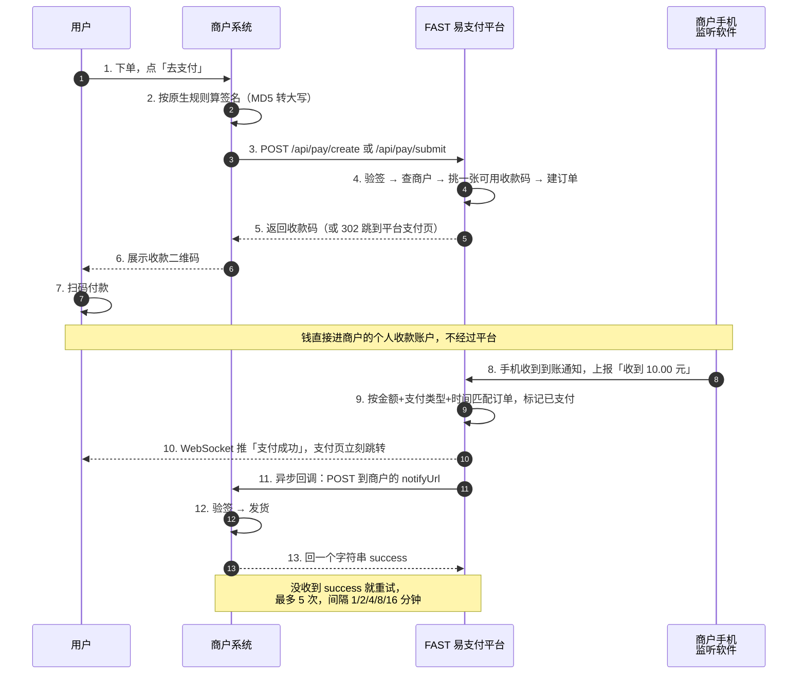
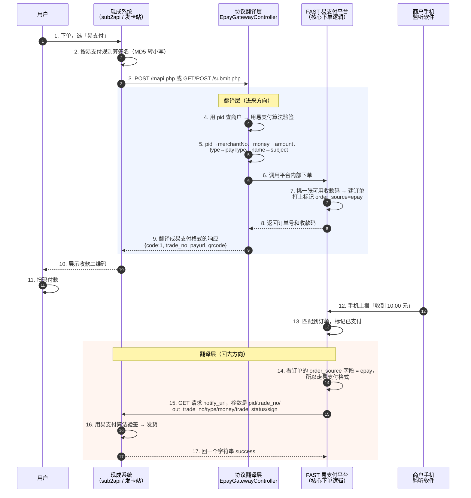

# ⚡ FAST 易支付

<p align="center">
  
</p>

<p align="center">
  <strong>个人免签支付平台 - 无需企业资质，个人收款码即可实现自动回调</strong>
</p>

<p align="center">
  <a href="https://github.com/xiaomo37564459/bigbear-fastpay">
    
  </a>
</p>

<p align="center">
  <a href="#在线演示">在线演示</a> •
  <a href="#功能特性">功能特性</a> •
  <a href="#系统截图">系统截图</a> •
  <a href="#技术栈">技术栈</a> •
  <a href="#快速开始">快速开始</a> •
  <a href="#api-接口文档">API 文档</a>
</p>

---

## 项目介绍

FAST 易支付是一款面向个人开发者和小型商户的**免签支付平台**，通过普通收款码即可实现收款通知自动回调。资金直达个人账户，无需提现，支持绝大多数商城系统对接。

### 适用场景

- 个人网站收款
- 小型电商平台
- 知识付费系统
- 会员充值系统
- 虚拟商品交易
- 捐赠打赏系统

## 在线演示

| 系统 | 演示地址 |
|------|----------|
| 🏪 **商户平台** | [https://pay.copliot.cloud/fastpay-merchant/](https://pay.copliot.cloud/fastpay-merchant/) |
| 🔧 **管理后台** | [https://pay.copliot.cloud/fastpay-admin/](https://pay.copliot.cloud/fastpay-admin/) |

> 💡 演示环境仅供体验，请勿用于生产环境。演示账号请联系管理员申请。

## 功能特性

| 特性 | 说明 |
|------|------|
| 🔐 **免签约** | 无需企业资质，个人收款码即可使用 |
| ⚡ **秒到账** | 资金直达个人账户，无需提现 |
| 🔄 **自动回调** | 支付成功自动通知，支持自动重试（最多5次，递增间隔） |
| 📱 **多通道** | 支持微信、支付宝等多种支付方式 |
| 🛠️ **易对接** | 提供页面跳转支付和 API 接口两种方式 |
| 🔔 **实时推送** | WebSocket 实时推送支付结果，页面即时响应 |
| 🎨 **现代 UI** | 简洁美观的用户界面，响应式设计 |
| 📊 **数据统计** | 完善的订单统计和数据看板 |

---

## 系统截图

### 产品首页

<p align="center">
  
</p>

<p align="center">
  
</p>

### 商户中心

#### 控制台数据看板

<p align="center">
  
</p>

#### 店铺管理

<p align="center">
  
</p>

#### 开发参数配置

<p align="center">
  
</p>

#### 消息通道

<p align="center">
  
</p>

#### 开发文档

<p align="center">
  
</p>

#### 开发对接

<p align="center">
  
</p>

#### 订单管理

<p align="center">
  
</p>

#### 订单详情

<p align="center">
  
</p>

### 管理后台

#### 控制台数据看板

<p align="center">
  
</p>

## 监听软件配置
Fastpay易支付使用的是开源监听工具是SmsForwarder。
开源项目地址：https://gitee.com/pp/SmsForwarder
### 通道配置
<p align="center">
  
</p>
<p align="center">
  
</p>

#### 转发规则配置

<p align="center">
  
</p>
<p align="center">
  
</p>

### 开发对接 Demo

#### Demo 首页

<p align="center">
  
</p>

#### 平台通用支付页面

<p align="center">
  
</p>

#### 商家自定义 API 支付页面

<p align="center">
  
</p>

---

## 系统架构

```
┌─────────────────────────────────────────────────────────────────────┐
│                          FAST 易支付系统                              │
├─────────────────────────────────────────────────────────────────────┤
│                                                                      │
│   ┌──────────────┐   ┌──────────────┐   ┌──────────────────────┐   │
│   │   管理后台    │   │   商户平台    │   │      支付页面         │   │
│   │   (Admin)    │   │  (Merchant)  │   │     (Pay Page)       │   │
│   │  Port: 3001  │   │  Port: 3002  │   │                      │   │
│   │              │   │              │   │  ┌────────────────┐  │   │
│   │  - 商户管理   │   │  - 店铺管理   │   │  │  收款二维码    │  │   │
│   │  - 店铺管理   │   │  - 通道管理   │   │  │  支付状态展示  │  │   │
│   │  - 订单管理   │   │  - 订单管理   │   │  │  WebSocket    │  │   │
│   │  - 数据统计   │   │  - 开发文档   │   │  └────────────────┘  │   │
│   └──────┬───────┘   └──────┬───────┘   └──────────┬───────────┘   │
│          │                  │                       │               │
│          └──────────────────┼───────────────────────┘               │
│                             │                                        │
│                      ┌──────▼──────┐                                │
│                      │   后端服务   │                                │
│                      │  (Server)   │                                │
│                      │  Port: 7001 │                                │
│                      │             │                                │
│                      │  Spring Boot 3.2                             │
│                      │  + MyBatis Plus                              │
│                      │  + WebSocket                                 │
│                      │  + JWT 认证                                  │
│                      └──────┬──────┘                                │
│                             │                                        │
│                      ┌──────▼──────┐                                │
│                      │   MySQL     │                                │
│                      │  Database   │                                │
│                      │   8.0+      │                                │
│                      └─────────────┘                                │
│                                                                      │
└─────────────────────────────────────────────────────────────────────┘
```

### 支付流程

平台**不是**微信/支付宝的官方支付接口，走的是「个人收款码 + 手机监听」这条路：商户把自己的个人收款码传上来，手机上装一个监听软件盯着到账通知；用户扫码付款后，监听软件把「收到 X 元」上报给平台，平台按**金额 + 支付类型 + 时间**匹配出是哪一笔订单，再通知商户系统发货。

#### 用平台原生接口的流程



#### 通过彩虹易支付协议接入的流程

同一条链路，区别只在**头尾多了一层「协议翻译」**：外部按易支付格式进来，翻译成平台自己的下单流程；回调时再翻译回易支付格式发出去。



> **`order_source` 是整个兼容方案的关键。** 订单建好那一刻就记下「这单从哪套接口进来的」（`native` / `epay`），付款成功后照这个字段决定用哪套格式发回调。
>
> **这条约束是为了防止什么问题？** 防止「老订单被新格式回调打坏」—— 如果不存来源、回调时靠猜，新功能上线的一瞬间所有存量老订单的回调格式就全变了，商户系统会集体验签失败、集体不发货。存了来源，老订单永远走老格式，商户一行代码都不用改。

**异步回调和同步跳转别搞混**：`notifyUrl`（异步回调）是平台服务器在后台通知你的服务器，用户关掉浏览器照样会发、收不到会重试；`returnUrl`（同步跳转）只是用户浏览器跳回你的页面，关掉就没了。**发货只能写在异步回调里。**

👉 完整的时序说明、回调重试策略、两套接口的全部参数，见 **[开发对接文档](docs/API.md)**。

---

## 项目结构

```
bigbear-fastpay/
├── docs/                        # 项目文档
│   ├── PROJECT.md              # 项目说明文档
│   ├── USER_GUIDE.md           # 使用说明文档
│   └── DEMO.md                 # Demo 说明文档
│
├── fastpay-server/              # 后端服务 (Spring Boot 3.2)
│   ├── src/main/java/com/fastpay/
│   │   ├── common/              # 通用类（Result、Constants、Exception）
│   │   ├── config/              # 配置类（Web、MyBatis、JWT、WebSocket）
│   │   ├── controller/          # 控制器
│   │   │   ├── admin/           # 管理后台接口
│   │   │   ├── merchant/        # 商户平台接口
│   │   │   ├── pay/             # 支付接口
│   │   │   └── notify/          # 回调接口
│   │   ├── dto/                 # 数据传输对象
│   │   ├── entity/              # 实体类
│   │   ├── mapper/              # MyBatis Mapper
│   │   ├── service/             # 服务层
│   │   ├── task/                # 定时任务
│   │   ├── util/                # 工具类
│   │   ├── vo/                  # 视图对象
│   │   └── websocket/           # WebSocket 支付结果推送
│   └── src/main/resources/
│       ├── db/                  # 数据库脚本
│       ├── application-dev.yml  # 开发环境配置
│       └── application-prod.yml # 生产环境配置
│
├── fastpay-admin/               # 管理后台 (Vue3 + Element Plus)
│   └── src/
│       ├── api/                 # API 接口
│       ├── layout/              # 布局组件
│       ├── router/              # 路由配置
│       ├── utils/               # 工具函数
│       └── views/               # 页面组件
│           ├── dashboard/       # 控制台
│           ├── merchant/        # 商户管理
│           ├── shop/            # 店铺管理
│           ├── channel/         # 通道管理
│           └── order/           # 订单管理
│
├── fastpay-merchant/            # 商户平台 (Vue3 + Element Plus)
│   └── src/
│       ├── api/                 # API 接口
│       ├── layout/              # 布局组件
│       ├── router/              # 路由配置
│       ├── utils/               # 工具函数
│       └── views/               # 页面组件
│           ├── dashboard/       # 控制台
│           ├── shop/            # 店铺管理
│           ├── channel/         # 通道管理
│           ├── order/           # 订单管理
│           ├── config/          # 开发配置
│           ├── docs/            # 开发文档
│           └── pay/             # 支付页面
│
├── fastpay-demo/                # 对接演示项目 (Spring Boot + Thymeleaf)
│   └── src/
│       ├── main/java/com/fastpay/demo/
│       │   ├── config/          # 支付配置
│       │   ├── controller/      # 支付控制器
│       │   ├── service/         # 支付服务
│       │   └── util/            # 签名工具
│       └── main/resources/
│           ├── templates/               # 页面模板
│           ├── application-dev.yml      # 开发环境配置（本地跑用这份）
│           └── application-prod.yml     # 生产环境配置（部署时由环境变量注入真实值）
│
└── imags/                       # 项目截图
```

---

## 技术栈

### 后端技术

| 技术 | 版本 | 说明 |
|------|------|------|
| Java | 17 | 开发语言 |
| Spring Boot | 3.2.0 | 基础框架 |
| MyBatis Plus | 3.5.5 | ORM 框架 |
| MySQL | 8.0+ | 关系型数据库 |
| JWT | 0.12.3 | 无状态身份认证 |
| WebSocket | - | 支付结果实时推送 |
| Hutool | 5.8.25 | Java 工具类库 |
| ZXing | 3.5.2 | 二维码识别 |
| Knife4j | 4.4.0 | API 文档 |
| Lombok | - | 简化代码 |

### 前端技术

| 技术 | 版本 | 说明 |
|------|------|------|
| Vue | 3.4+ | 前端框架 |
| Element Plus | 2.4+ | UI 组件库 |
| Vue Router | 4.x | 路由管理 |
| Axios | - | HTTP 请求库 |
| Vite | 5.x | 构建工具 |
| qrcode | - | 二维码生成 |
| jsQR | - | 二维码解析 |

---

## 快速开始

### 环境要求

- JDK 17+
- Node.js 18+
- MySQL 8.0+
- Maven 3.8+

### 1. 克隆项目

```bash
git clone https://github.com/xiaomo37564459/bigbear-fastpay.git
cd bigbear-fastpay
```

### 2. 数据库初始化

```sql
-- 创建数据库
CREATE DATABASE bigbear_fastpay DEFAULT CHARACTER SET utf8mb4 COLLATE utf8mb4_unicode_ci;

-- 执行初始化脚本
source fastpay-server/src/main/resources/db/init.sql
```

### 3. 启动后端服务

```bash
cd fastpay-server

# 修改配置文件 src/main/resources/application-dev.yml
# - 数据库连接信息（username、password）
# - JWT 密钥
# - 支付页面域名

# 启动服务
mvn spring-boot:run -Dspring-boot.run.profiles=dev
```

服务地址：http://localhost:7001/fastpay-server

**首次启动的管理员账号**：
- 用户名默认 `admin`，可用环境变量 `FASTPAY_ADMIN_INITIAL_USERNAME` 覆盖
- 密码不设默认值，服务首次启动时随机生成一次 16 位密码，明文只写到 `warn` 级别日志里一次；生产环境请从启动日志里拿到后立刻改
- 想在本地开发指定固定密码，用环境变量 `FASTPAY_ADMIN_INITIAL_PASSWORD=...` 启动

### 4. 启动管理后台

```bash
cd fastpay-admin
npm install
npm run dev
```

访问地址：http://localhost:3001

### 5. 启动商户平台

```bash
cd fastpay-merchant
npm install
npm run dev
```

访问地址：http://localhost:3002

### 6. 启动对接演示（可选）

```bash
cd fastpay-demo

# 修改配置文件 src/main/resources/application-dev.yml
# - 商户编号、API密钥
# - 支付网关地址

# 一定要带 profiles=dev，否则读不到 application-dev.yml，服务能起但配置全空
mvn spring-boot:run -Dspring-boot.run.profiles=dev
```

访问地址：http://localhost:7002

---

## API 接口文档

> 📘 **完整接口文档在这里：[docs/API.md](docs/API.md)** —— 每个接口的全部参数（字段名、类型、必填、含义、示例）、返回字段说明、错误码表、两套签名算法的完整可抄示例、从零接入指引、排查手册，都在那份文档里。下面是速查版。

### 平台开了两套接口，先选一套

| | 第一套：平台原生接口 | 第二套：彩虹易支付协议接口 |
|---|---|---|
| 地址 | `/api/pay/create`、`/api/pay/submit` … | `/submit.php`、`/mapi.php`、`/api.php` |
| 参数名风格 | `merchantNo`、`outTradeNo`（驼峰） | `pid`、`out_trade_no`（下划线） |
| 签名 | 末尾拼 `&key=密钥`，MD5 转**大写** | 末尾**直接拼密钥**，MD5 转**小写** |
| 回调 | **POST** 表单 | **GET** 查询串 |
| 谁该用 | 自己写代码对接 | 用现成系统（sub2api、发卡站、V 商城） |

**⚠️ 两套签名算法不一样，混用必定验签失败 —— 这是接入方最容易踩的坑。** 走 `/api/pay/*` 用第一套，走 `*.php` 用第二套，详见 [docs/API.md 第八章](docs/API.md#八两套签名算法千万别拿混)。

两套**共用同一个商户号和密钥**，不用另外申请：易支付的 `pid` 就是平台的商户编号 `merchantNo`，易支付的商户密钥就是平台的 `apiSecret`，都在「商户平台 → 开发配置」里看。

### 接口速查

**所有地址都要加前缀 `https://你的域名/fastpay-server`**（服务的 context-path）。

| 接口 | 方法 | 要签名 | 说明 |
|------|------|------|------|
| `/api/pay/create` | POST | 原生 | 后端下单，返回收款码内容 |
| `/api/pay/submit` | POST | 原生 | 表单下单，302 跳到平台支付页 |
| `/api/pay/query` | GET | 否 | 用商户订单号查订单状态 |
| `/api/pay/page/{orderNo}` | GET | 否 | 支付页面数据 |
| `/api/pay/status/{orderNo}` | GET | 否 | 轮询支付状态 |
| `/api/pay/result/{orderNo}` | GET | 否 | 支付结果页数据 |
| `/ws/pay/{merchantNo}/{outTradeNo}` | WS | 否 | 支付结果实时推送 |
| `/submit.php` | GET/POST | 易支付 | 易支付页面跳转下单 |
| `/mapi.php` | GET/POST | 易支付 | 易支付 API 下单，返回 JSON |
| `/api.php?act=order` | GET/POST | 易支付 | 易支付查订单 |
| `/api.php?act=refund` | GET/POST | —— | 退款占位，本期返回「未实现」 |
| `/api/notify/callback` | POST | HmacSHA256 | 监听软件上报到账（平台内部用） |
| `/api/merchant/callback-config` | PUT | 否（要登录） | 改回调地址 / 跳转地址 |
| `/api/merchant/reset-key` | POST | 否（要登录） | 重置 API 密钥 |
| `/api/merchant/order/{orderNo}/notify` | POST | 否（要登录） | 手动重发回调 |

服务启动后还可以看在线接口文档：`https://你的域名/fastpay-server/doc.html`

### 原生接口下单：`POST /api/pay/create`

**Content-Type**：`application/json`

| 参数 | 必填 | 类型 | 说明 |
|------|------|------|------|
| `merchantNo` | 是 | String | 商户编号 |
| `outTradeNo` | 是 | String | 商户订单号（同一商户下唯一） |
| `shopNo` | 是 | String | 店铺编号，决定用哪个店的收款码 |
| `amount` | 是 | 数字 | 订单金额（元），最小 `0.01` |
| `subject` | 是 | String | 商品名称 |
| `payType` | 是 | String | `wxpay` / `alipay` |
| `timestamp` | 是 | 数字 | 时间戳，**10 位秒级**，和服务器差 5 分钟内 |
| `sign` | 是 | String | 签名，**32 位大写** |
| `extParam` | 否 | String | 扩展参数，回调时原样返回 |

> **⚠️ 三个最容易踩的坑：**
> 1. **`shopNo` 是必填的**，而且要参与签名 —— 最常被漏掉的就是它。
> 2. **这个接口没有 `notifyUrl` 参数**：回调地址取商户在「开发配置」里配的那个，请求里传了不生效，还会导致验签失败。要改用 `PUT /api/merchant/callback-config`。
> 3. **`returnUrl` 只在 `/api/pay/submit` 生效**，`create` 里传了不起作用，但传了就必须参与签名。建议直接别传。

**响应示例**

```json
{
  "code": 200,
  "message": "操作成功",
  "data": {
    "orderNo": "FP20260819120000123456",
    "outTradeNo": "ORDER20260819001",
    "amount": 10.00,
    "payType": "wxpay",
    "payMethod": "api",
    "qrcodeUrl": "weixin://wxpay/bizpayurl?pr=xxxxxxxx",
    "payPageUrl": null,
    "expireTime": "2026-08-19T12:03:00.422774"
  },
  "timestamp": 1755561600123
}
```

**⚠️ 成功的 `code` 是 `200` 不是 `0`；失败时 HTTP 状态码也是 200，判断成败只能看响应体里的 `code`。**

### 签名算法：两套，分开写

#### 第一套（原生 `/api/pay/*`）

排序 → 拼 `a=1&b=2` → 末尾拼 **`&key=密钥`** → MD5 → **转大写**

```
amount=10.00&merchantNo=M17390000123400&outTradeNo=ORDER20260819001&payType=wxpay&shopNo=S17390000123401&subject=测试商品&timestamp=1755561600&key=your-merchant-key
```

MD5 转大写 = `4340BBCF38A2296A064AE850D0F4EB6F`

#### 第二套（易支付 `*.php`）

排序 → 去掉 `sign`/`sign_type`/空值 → 拼 `a=1&b=2` → 末尾**直接拼密钥** → MD5 → **转小写**

```
money=10.00&name=测试商品&notify_url=https://your-site.com/pay/notify&out_trade_no=ORDER20260819001&pid=M17390000123400&return_url=https://your-site.com/pay/result&type=wxpayyour-merchant-key
```

MD5 转小写 = `44175b98b2b0f726a31a31a1414e8116`

> 上面两个签名值都是真的，可以自己 `printf '%s' '……' | md5sum` 验一遍。PHP / Java / Python 三种语言的现成实现见 [docs/API.md 第八章](docs/API.md#八两套签名算法千万别拿混)。

### 回调通知

支付成功后，平台按**订单来源**决定用哪套格式通知你：

| 下单走的接口 | 回调方式 | 回调参数 | 签名 |
|---|---|---|---|
| `/api/pay/*` | **POST** 表单 | `merchantNo`、`orderNo`、`outTradeNo`、`amount`、`payAmount`、`payType`、`status`、`payTime`、`timestamp`、`extParam`、`sign` | 原生（大写） |
| `*.php` | **GET** 查询串 | `pid`、`trade_no`、`out_trade_no`、`type`、`name`、`money`、`trade_status`、`sign`、`sign_type` | 易支付（小写） |

**不管哪套，你都必须返回字符串 `success`**，否则平台会重试：最多 5 次，间隔 1 / 2 / 4 / 8 / 16 分钟，5 次用完要人工在后台点「重发通知」。

**⚠️ 回调可能重复发送，你的处理必须做到「重复收到同一笔也不会出错」** —— 先查自己库里这单的状态，已处理过就直接回 `success`，只有未处理时才发货。不然重试机制会让你重复发货。

带验签、防重复、核对金额的完整 PHP 示例见 [docs/API.md 第五章](docs/API.md#五回调通知平台--你的系统)。

---

## 兼容彩虹易支付协议（给 sub2api 之类的通用商城系统对接）

除了原生 `/api/pay/*` 接口，服务端还多提供了一组**彩虹「易支付」通用协议**的入口。你在 sub2api、V 商城、发卡站等等**任何支持易支付协议**的系统后台里，把「易支付」类型的支付方式配置一下，就能直接对接，不用改代码。

> 老的 `/api/pay/*` 接口继续照常工作。两套接口是并存关系，本节只是新增了一条路径。

### 在对方系统（比如 sub2api）后台怎么填

| 字段 | 填什么 |
|---|---|
| **商户号（pid）** | 平台里的**商户编号**（形如 `M17390000123400` 那种），到「商户平台 → 开发配置」里能看到 |
| **商户密钥（key）** | 平台里的 **API Secret**，同上一个页面 |
| **接口地址** | `http(s)://<你的服务器>/fastpay-server/`（**注意末尾要带 `/`**，对方会自动拼 `submit.php` / `mapi.php`） |

填完，测一笔真金白银 0.01 元的订单，能扫码付款、订单变已支付，就算通了。

### 三个接口的用途

| 接口 | 方法 | 用途 |
|---|---|---|
| `/fastpay-server/submit.php` | GET / POST | 用户扫码前的**页面跳转**入口，会自动 302 到平台支付页 |
| `/fastpay-server/mapi.php` | POST | 对方系统**后端**下单入口，返回 JSON 里带 `payurl` 和 `qrcode` |
| `/fastpay-server/api.php?act=order` | GET / POST | 订单**查询**入口（对方系统兜底轮询用） |
| `/fastpay-server/api.php?act=refund` | GET / POST | 退款入口的**兜底占位**：本期不做退款，会明确返回 `{code:-1, msg:"本期未实现退款..."}` |

> ⚠️ **本期不支持退款**：请在 sub2api 后台把 `refund_enabled` / `allow_user_refund` 关掉，用户端就不会出现退款入口，`refund` 也不会被调用。上面那个兜底只是防对方版本忽略配置照发。

### 下单参数（`submit.php` / `mapi.php` 通用）

| 字段 | 必填 | 类型 | 说明 | 示例 |
|---|---|---|---|---|
| `pid` | 是 | String | 商户号，**就是平台的商户编号 `merchantNo`**，不用另外申请 | `M17390000123400` |
| `type` | 是 | String | 支付方式：`wxpay`=微信，`alipay`=支付宝 | `wxpay` |
| `out_trade_no` | 是 | String | 对方系统的订单号，同一商户下不能重复 | `ORDER20260819001` |
| `money` | 是 | String | 金额（元），必须大于 0 | `10.00` |
| `name` | 是 | String | 商品名称 | `测试商品` |
| `notify_url` | 否 | String | **异步回调地址**，每笔单独指定；不传就用商户的默认配置 | `https://your-site.com/pay/notify` |
| `return_url` | 否 | String | **同步跳转地址**，用户付完款浏览器跳这里 | `https://your-site.com/pay/result` |
| `sign` | 是 | String | 签名，**32 位小写** | `44175b98…` |
| `sign_type` | 否 | String | 固定 `MD5`，**不参与签名计算** | `MD5` |

> **不需要传店铺号**：易支付协议里没有「店铺」概念，平台会在该商户名下所有店铺里自动挑一张可用收款码。
>
> **对方系统额外带的参数（`clientip`、`device` 等）平台不使用，但它们必须参与签名** —— 「收到什么就签什么」，别自己挑字段。

`mapi.php` 成功返回：

```json
{"code":1,"msg":"success","trade_no":"FP20260819120000123456","payurl":"http://.../pay/FP20260819120000123456","qrcode":"weixin://wxpay/bizpayurl?pr=xxxxxxxx"}
```

**`code=1` 才是成功**（易支付协议的约定），失败是 `{"code":-1,"msg":"失败原因"}`，HTTP 状态码都是 200。
`submit.php` 成功是 **302 跳转**，失败是 **HTTP 400 + 纯文本** `下单失败：xxx` —— 两个接口的失败返回格式不一样，别套用同一套解析。

完整字段说明、全部错误文案、查询接口参数见 **[docs/API.md 第四章](docs/API.md#四彩虹易支付协议接口-php)**。

### 回调通知（`notify_url`）

用户付款成功后，平台会**按易支付协议格式**请求你在下单时填的 `notify_url`：

```
GET https://your-site.com/pay/notify?money=10.00&name=%E6%B5%8B%E8%AF%95%E5%95%86%E5%93%81&out_trade_no=ORDER20260819001&pid=M17390000123400&sign=98eb26dd531b12d5ccb20339145de5ba&sign_type=MD5&trade_no=FP20260819120000123456&trade_status=TRADE_SUCCESS&type=wxpay
```

验签通过后，回一个字符串 `success` 就算完成。**收不到 `success` 平台会重试，最多 5 次，间隔 1/2/4/8/16 分钟。**

**⚠️ 回调可能重复送达，你的处理必须幂等**（同一笔重复收到不能重复发货）：先查自己库里的状态，已处理过就直接回 `success`。

老的 `/api/pay/*` 接口下单的老订单**回调格式完全没变**，还是 POST，不受影响 —— 靠订单表里的 `order_source` 字段区分，见上面的[支付流程](#支付流程)。

带验签、防重复、核对金额的完整 PHP 示例见 [docs/API.md 5.2](docs/API.md#52-易支付格式的回调get)。

### 签名算法（**和平台原生的不一样，别拿混了**）

彩虹易支付通用协议的签名：

1. 参数按名字 **ASCII 升序**排
2. 去掉 `sign`、`sign_type`，去掉空值参数
3. 拼成 `a=1&b=2&c=3` 这种形式（**不做 URL 编码**）
4. 末尾**直接拼商户密钥**（注意：**不是** `&key=密钥`）
5. MD5 后转**小写**

**能照着抄的完整例子** —— 商户号 `M17390000123400`、密钥 `your-merchant-key`：

```
money=10.00&name=测试商品&notify_url=https://your-site.com/pay/notify&out_trade_no=ORDER20260819001&pid=M17390000123400&return_url=https://your-site.com/pay/result&type=wxpayyour-merchant-key
```

MD5 转小写 = `44175b98b2b0f726a31a31a1414e8116`（这个值是真的，可以自己 `printf '%s' '……' | md5sum` 验一遍）

> **⚠️ 和平台原生签名的三个区别**：原生末尾拼 `&key=密钥`、结果转**大写**、不排除 `sign_type` 和空值。**混用必定验签失败，而且肉眼对比签名串看不出问题在哪。**

对照代码：`fastpay-server/src/main/java/com/fastpay/util/EpaySignUtil.java`。PHP / Java / Python 现成实现见 [docs/API.md 8.2](docs/API.md#82-第二套彩虹易支付签名算法)。

### 关于路径前缀

服务默认起在 `/fastpay-server` context path 下，所以对外真实地址是 `/fastpay-server/submit.php`。

- **推荐**：直接在 sub2api 后台填带前缀的完整地址，绝大多数版本都能识别
- **备选**：如果对方版本硬要求根路径（`/submit.php`），在 nginx 里加一段转发：

```nginx
location ~ ^/(submit|mapi|api)\.php$ {
    proxy_pass http://127.0.0.1:7001/fastpay-server$request_uri;
    proxy_set_header Host $host;
    proxy_set_header X-Real-IP $remote_addr;
    proxy_set_header X-Forwarded-For $proxy_add_x_forwarded_for;
}
```

改 nginx 之前先 `nginx -t`，改完记得 reload 前确认其他站点没受影响。

### 快速自测（curl）

```bash
# 1) 算签名（末尾直接拼密钥，结果保持小写）
printf '%s' 'money=1.00&name=测试&notify_url=http://your.callback/notify&out_trade_no=T1&pid=你的商户号&type=alipay你的APISecret' | md5sum

# 2) 下单
curl -X POST http://localhost:7001/fastpay-server/mapi.php \
  -d 'pid=你的商户号' \
  -d 'type=alipay' \
  -d 'out_trade_no=T1' \
  -d 'name=测试' \
  -d 'money=1.00' \
  -d 'notify_url=http://your.callback/notify' \
  -d 'sign_type=MD5' \
  -d 'sign=<上面算出来的签名>'

# 3) 查订单（这一步的签名只含 out_trade_no 和 pid，act 和 key 都不参与签名）
printf '%s' 'out_trade_no=T1&pid=你的商户号你的APISecret' | md5sum
curl 'http://localhost:7001/fastpay-server/api.php?act=order&pid=你的商户号&out_trade_no=T1&sign=<刚算的签名>&sign_type=MD5'
```

第 2 步返回 `{"code":1, "msg":"success", "trade_no":"...", "payurl":"...", "qrcode":"..."}` 表示对通了。

👉 从零接入的完整步骤（拿密钥 → 配收款码 → 配回调 → 发第一笔 → 处理回调 → 上线自查清单）见 **[docs/API.md 第十章](docs/API.md#十从零接入照着做就行)**；签名验不过、回调收不到怎么排查见 **[第十一章](docs/API.md#十一出问题了怎么查)**。

---

## 对接演示

项目提供了完整的对接演示项目 `fastpay-demo`，包含：

- **页面跳转支付**：表单提交跳转到平台支付页面
- **API 接口支付**：后端调用获取二维码，自定义支付页面
- **订单状态查询**：主动查询订单支付状态
- **回调通知处理**：接收并验证支付回调
- **签名生成与验证**：完整的签名工具类

详细说明请查看 [Demo 说明文档](docs/DEMO.md)

---

## 功能模块

### 管理后台

| 模块 | 功能 |
|------|------|
| 控制台 | 数据统计、订单概览、今日/本周/本月数据 |
| 商户管理 | 商户列表、创建商户、状态管理、重置密码 |
| 店铺管理 | 店铺列表、二维码管理 |
| 通道管理 | 支付通道配置 |
| 订单管理 | 订单列表、订单详情、手动确认、重发回调 |

### 商户平台

| 模块 | 功能 |
|------|------|
| 控制台 | 数据统计、快捷操作 |
| 店铺管理 | 店铺管理、二维码管理、订单记录 |
| 通道管理 | 支付通道配置 |
| 订单管理 | 订单列表、订单详情 |
| 开发配置 | API 密钥、回调地址配置、监听软件配置 |
| 开发文档 | 接口文档、代码示例、签名说明 |

---

## 数据库设计

### 核心表结构

| 表名 | 说明 |
|------|------|
| admin | 管理员表 |
| merchant | 商户表 |
| shop | 店铺表 |
| merchant_channel | 商户通道表 |
| pay_qrcode | 收款二维码表 |
| pay_order | 支付订单表 |

---

## 部署说明

### 生产环境配置

```yaml
# application-prod.yml
server:
  port: 7001
  servlet:
    context-path: /fastpay-server

spring:
  datasource:
    url: jdbc:mysql://localhost:3306/bigbear_fastpay?useSSL=false&serverTimezone=Asia/Shanghai
    username: your_username
    password: your_password

fastpay:
  jwt:
    secret: your-jwt-secret-key
    expire-hours: 12
  pay:
    order-timeout-minutes: 3
    page-domain: https://your-domain/fastpay-merchant
```

### Nginx 配置示例

```nginx
server {
    listen 80;
    server_name pay.your-domain.com;

    # 后端 API
    location /fastpay-server {
        proxy_pass http://127.0.0.1:7001;
        proxy_set_header Host $host;
        proxy_set_header X-Real-IP $remote_addr;
        proxy_set_header X-Forwarded-For $proxy_add_x_forwarded_for;
    }

    # WebSocket
    location /fastpay-server/ws {
        proxy_pass http://127.0.0.1:7001;
        proxy_http_version 1.1;
        proxy_set_header Upgrade $http_upgrade;
        proxy_set_header Connection "upgrade";
    }

    # 商户平台前端
    location /fastpay-merchant {
        alias /var/www/fastpay-merchant/dist;
        try_files $uri $uri/ /fastpay-merchant/index.html;
    }

    # 管理后台前端
    location /fastpay-admin {
        alias /var/www/fastpay-admin/dist;
        try_files $uri $uri/ /fastpay-admin/index.html;
    }
}
```

---

## 详细文档

| 文档 | 说明 |
|------|------|
| **[开发对接文档](docs/API.md)** | **接了这个系统就看这份**：两套接口的全部参数、返回字段、错误码、两套签名算法、支付流程图、从零接入指引、排查手册 |
| [项目说明文档](docs/PROJECT.md) | 系统架构、技术栈、数据库设计、安全设计 |
| [使用说明文档](docs/USER_GUIDE.md) | 安装部署、后台怎么用、生产部署 |
| [Demo 说明文档](docs/DEMO.md) | 对接演示项目详细说明 |
| [部署说明](docs/DEPLOY.md) | 线上环境怎么发版、怎么回退、出问题怎么查 |
| [提交代码后的自动检查](docs/CI.md) | 每个 PR 自动「合最新主干 + 跑全部测试」：怎么触发、从哪看结果、本地怎么跑同样一套 |
| [敏感信息怎么处理](docs/SECRETS.md) | **提交前必读**：什么能写进这个公开仓库、什么绝对不能、密码密钥该放哪 |

---

## 开发者

**xiaomo37564459**

## 许可证

MIT License

---

## 更新日志

### v1.0.0 (2025)

- 初始版本发布
- 支持微信、支付宝收款
- 页面跳转支付和 API 接口支付
- 管理后台和商户平台
- WebSocket 实时支付结果推送
- 回调通知自动重试机制（最多5次，递增间隔）
- 完整的对接演示项目
