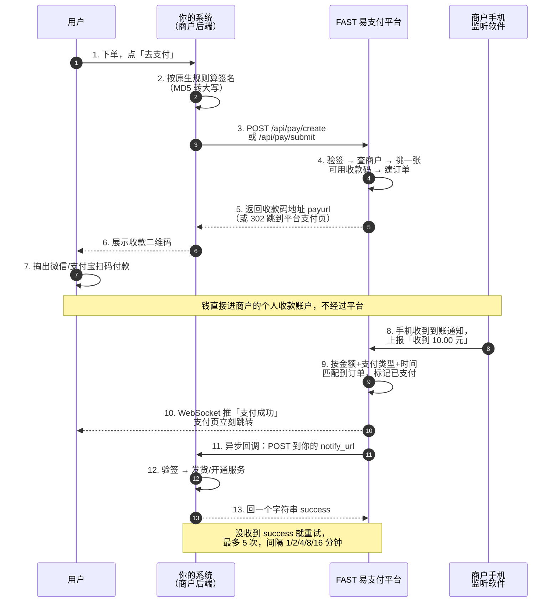
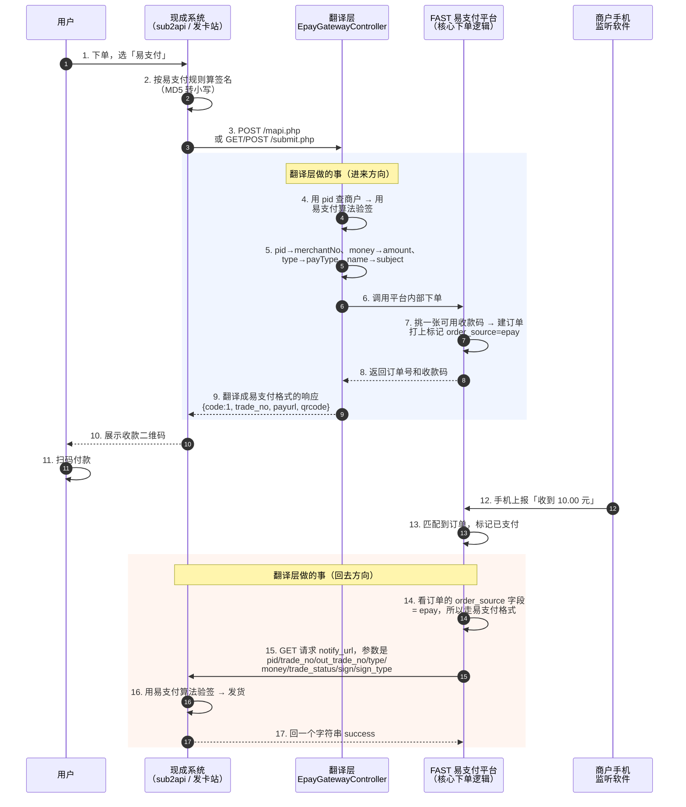

开发对接文档（接口 + 支付流程）
==============================

这份文档是给**要把自己系统接到 FAST 易支付上**的人看的：你的商城、发卡站、APP 想收钱，钱要怎么走、接口怎么调、回调怎么处理，这里全写清楚。

文档里所有参数名、返回字段、签名算法都是**照着代码逐个核对过的**，不是凭印象写的。每个接口后面都标了对应的源码位置，怀疑哪里对不上可以直接翻代码。

> **文档里出现的商户号、密钥、订单号全是假的**（密钥统一写成 `your-merchant-key`）。真实密钥只在「商户平台 → 开发配置」页面里看，不要贴到任何公开地方。

---

## 目录

- [一、先搞清楚：这里有两套接口](#一先搞清楚这里有两套接口)
- [二、一笔钱是怎么走完整个流程的](#二一笔钱是怎么走完整个流程的)
- [三、平台原生接口 `/api/pay/*`](#三平台原生接口-apipay)
- [四、彩虹易支付协议接口 `*.php`](#四彩虹易支付协议接口-php)
- [五、回调通知（平台 → 你的系统）](#五回调通知平台--你的系统)
- [六、收款监听软件的上报接口](#六收款监听软件的上报接口)
- [七、商户自己用的配置接口](#七商户自己用的配置接口)
- [八、两套签名算法（千万别拿混）](#八两套签名算法千万别拿混)
- [九、错误码对照表](#九错误码对照表)
- [十、从零接入，照着做就行](#十从零接入照着做就行)
- [十一、出问题了怎么查](#十一出问题了怎么查)

---

## 一、先搞清楚：这里有两套接口

平台对外开了**两套完全独立的接口**，功能一样（都是下单收钱），但是**参数名不一样、签名算法也不一样**。

| | 第一套：平台原生接口 | 第二套：彩虹易支付协议接口 |
|---|---|---|
| 地址长什么样 | `/api/pay/create`、`/api/pay/submit` … | `/submit.php`、`/mapi.php`、`/api.php` |
| 参数名风格 | `merchantNo`、`outTradeNo`、`payType`（驼峰） | `pid`、`out_trade_no`、`type`（下划线） |
| 签名怎么算 | 末尾拼 `&key=密钥`，MD5 转**大写** | 末尾**直接拼密钥**，MD5 转**小写** |
| 谁该用 | 你自己写代码对接，想要完整功能（指定店铺、扩展参数） | 你用的是现成系统（sub2api、发卡站、V 商城），它本来就支持「易支付」 |
| 回调发过来是 | **POST** 表单 | **GET** 查询串 |

**⚠️ 这是接入方最容易踩的坑：两套签名算法长得很像，但结果完全不同，混用必定验签失败。**

> **为什么要分开？** 第二套是「翻译层」：外部系统按易支付协议的格式进来，平台内部翻译成自己的下单流程，回调的时候再翻译回易支付格式发出去。如果把两套签名合并成一套，任何一边的协议要改，另一边就会跟着一起坏 —— 所以代码里也是两个独立的类（`SignUtil` 和 `EpaySignUtil`），谁也不许替代谁。

**怎么选？** 一句话：**你手上是现成系统就用第二套，你自己写代码就用第一套。**

### 两套共用同一份商户号和密钥

不用另外申请账号。易支付协议里的 `pid` 和 `key`，就是平台里的商户编号和 API Secret：

| 易支付协议里叫 | 平台里叫 | 在哪看 | 长什么样（示例） |
|---|---|---|---|
| `pid` | 商户编号 `merchantNo` | 商户平台 → 开发配置 | `M17390000123400` |
| 商户密钥 `key` | API Secret `apiSecret` | 商户平台 → 开发配置 | 32 位字符串 |
| `out_trade_no` | 商户订单号 `outTradeNo` | 你自己系统里的订单号 | `ORDER20260819001` |
| `trade_no` | 平台订单号 `orderNo` | 平台生成，`FP` 开头 | `FP20260819120000123456` |
| `money` | 订单金额 `amount` | —— | `10.00` |
| `name` | 商品名称 `subject` | —— | `测试商品` |
| `type` | 支付类型 `payType` | —— | `wxpay` / `alipay` |

### 地址前缀 `/fastpay-server` 是怎么回事

后端服务跑在 `/fastpay-server` 这个路径下（配置项 `server.servlet.context-path`），所以**对外的真实地址都要带这个前缀**：

- 原生接口：`https://你的域名/fastpay-server/api/pay/create`
- 易支付接口：`https://你的域名/fastpay-server/mapi.php`

**下文所有接口地址都省略了这个前缀**，你拼地址的时候记得加上。

如果对方系统死活只认根路径的 `/submit.php`，在 nginx 里加一段转发就行（见 [十一、出问题了怎么查](#十一出问题了怎么查)）。

---

## 二、一笔钱是怎么走完整个流程的

### 2.1 这个系统是怎么收到钱的（背景，一分钟看懂）

平台**不是**微信/支付宝的官方支付接口，它走的是「个人收款码 + 手机监听」这条路：

1. 商户把自己的微信/支付宝**个人收款码**上传到平台
2. 商户手机上装一个**监听软件**，专门盯着「微信收款助手」「支付宝收款」这类到账通知
3. 用户扫码付钱 → 商户手机弹出到账通知 → 监听软件把「收到 X 元」上报给平台
4. 平台按**金额 + 支付类型 + 时间**去匹配是哪一笔订单，匹配上就标记为已支付
5. 平台再通知你的系统「这单付了」

**所以有两条链路要分清楚：**

- **监听软件 → 平台**：靠 `/api/notify/callback` 上报，是平台自己内部的事，你不用管
- **平台 → 你的系统**：靠你填的 `notify_url` 通知，**这条才是你要写代码处理的**

> ⚠️ 因为靠金额匹配订单，**同一个商户同一时间不能有两笔金额完全相同的待支付订单**，否则会匹配错。测试的时候一笔一笔来。

### 2.2 用平台原生接口的完整流程



### 2.3 用彩虹易支付协议接入的完整流程

跟上面是同一条链路，区别只在**头尾多了一层「翻译」**：进来的时候把易支付格式翻译成平台自己的下单流程，回调的时候再翻译回易支付格式。



> **`order_source` 这个字段是整个兼容方案的关键。** 订单建好的那一刻就记下「这单是从哪套接口进来的」（`native` 还是 `epay`），付款成功后回调时照这个字段决定用哪套格式发通知。
>
> **这条约束是为了防止什么问题？** 防止「老订单被新格式回调打坏」。如果不存来源、回调时靠猜（比如看 notify_url 长什么样），那 PR 上线的一瞬间，所有存量老订单的回调格式就全变了，商户系统会集体验签失败、集体不发货。存了来源，老订单（`order_source` 是 `native` 或者是空的历史数据）永远走老格式，一行商户代码都不用改。

### 2.4 异步回调和同步跳转，区别在哪

这两个东西经常被搞混，但作用完全不同：

| | 异步回调 `notify_url` | 同步跳转 `return_url` |
|---|---|---|
| 一句话 | 平台的服务器**在后台**告诉你服务器「这单付了」 | 用户付完款，浏览器**跳回**你的页面 |
| 谁发起 | 平台服务器 → 你的服务器 | 用户的浏览器 |
| 用户关掉浏览器还会发生吗 | **会**，照常通知 | **不会**，跳转就没了 |
| 收不到会重试吗 | **会**，最多 5 次 | 不会 |
| 能拿它当发货依据吗 | **能，只能拿它** | **不能** |

**⚠️ 一条硬规矩：发货、加余额、开通服务，只能在异步回调里做。**

**这条是为了防止什么问题？** 防止两种事故：一是用户付完款直接关掉浏览器，同步跳转根本不会触发，你就永远不发货；二是同步跳转的地址在浏览器地址栏里，用户可以自己手敲一个「支付成功」的链接骗你发货。异步回调走的是服务器到服务器、带签名，伪造不了。

### 2.5 回调失败了怎么办（重试机制）

平台发出回调后，**必须收到你返回的字符串 `success`**（不区分大小写）才算成功。

- 返回别的内容、或者请求超时（5 秒）、或者你的服务器没响应 → 这次算失败
- 失败的订单由定时任务捞出来重发，**每分钟检查一次**
- **最多重发 5 次**，间隔一次比一次长：第 1 次失败后等 1 分钟、然后 2 分钟、4 分钟、8 分钟、16 分钟
- 5 次用完还是失败，就不再自动重试了，需要**人工在管理后台点「重发通知」**

| 订单上的字段 | 含义 |
|---|---|
| `notifyStatus` | `0`=还没通知，`1`=通知成功，`2`=通知失败 |
| `notifyCount` | 已经通知了几次 |
| `lastNotifyTime` | 最后一次通知的时间 |

**⚠️ 你的回调处理必须做到「重复收到同一笔也不会出错」。** 因为重试机制的存在，同一笔订单的回调**可能被发送多次**。

**这条是为了防止什么问题？** 防止重复发货、重复加余额。正确做法：收到回调先拿 `out_trade_no` 查自己库里这单的状态，**已经处理过就直接回 `success` 然后什么都不做**，只有状态还是「未支付」时才执行发货。

对应源码：`PayOrderServiceImpl#processFailedNotify`、`NotifyRetryTask`

---

## 三、平台原生接口 `/api/pay/*`

对应源码：`fastpay-server/src/main/java/com/fastpay/controller/pay/PayController.java`

这几个接口**不需要登录**（不用带 token），身份靠签名验证。

| 接口 | 方法 | 干什么用的 | 要签名吗 |
|---|---|---|---|
| `/api/pay/create` | POST | 后端下单，拿到收款二维码，自己渲染支付页 | 要 |
| `/api/pay/submit` | POST | 表单提交下单，直接跳到平台的支付页 | 要 |
| `/api/pay/query` | GET | 用你自己的订单号查这单付了没 | 不要 |
| `/api/pay/page/{orderNo}` | GET | 支付页面要展示的数据（平台支付页自己用） | 不要 |
| `/api/pay/status/{orderNo}` | GET | 只查支付状态，用来轮询 | 不要 |
| `/api/pay/result/{orderNo}` | GET | 支付结果页要展示的数据 | 不要 |

---

### 3.1 `POST /api/pay/create` —— 后端下单，拿收款码

**干什么用的**：你的后端调一次，拿到一个收款二维码的内容，然后你自己把二维码画在自己的页面上。适合 APP、小程序、或者你想完全自己控制支付页样式的场景。

**Content-Type**：`application/json`

**请求参数**（放在 JSON 请求体里）

| 字段 | 类型 | 必填 | 这个字段是什么意思 | 示例 |
|---|---|---|---|---|
| `merchantNo` | String | **是** | 商户编号。在「商户平台 → 开发配置」里看 | `M17390000123400` |
| `outTradeNo` | String | **是** | **你自己系统里的订单号**。同一个商户下不能重复，重复会报「商户订单号已存在」 | `ORDER20260819001` |
| `shopNo` | String | **是** | 店铺编号。一个商户下可以开多个店，这里指定这笔钱算哪个店的，也决定用哪个店的收款码 | `S17390000123401` |
| `amount` | 数字 | **是** | 订单金额，**单位是元**，最小 `0.01`。写成两位小数，如 `10.00` | `10.00` |
| `subject` | String | **是** | 商品名称 / 订单描述，会显示在支付页上 | `测试商品` |
| `payType` | String | **是** | 用哪种支付方式：`wxpay`=微信，`alipay`=支付宝 | `wxpay` |
| `timestamp` | 数字 | **是** | 当前时间戳，**单位是秒**（10 位，不是 13 位毫秒）。和服务器时间差超过 5 分钟会报「请求已过期」 | `1755561600` |
| `sign` | String | **是** | 签名，算法见 [8.1](#81-第一套平台原生签名算法) | `4340BBCF…` |
| `extParam` | String | 否 | 扩展参数，你想带什么就带什么（一般放 JSON 字符串），**回调时原样还给你** | `{"uid":8801}` |
| `returnUrl` | String | 否 | 见下方注意事项 | —— |
| `payMethod` | String | 否 | **不用传**，传了也会被接口强制改成 `api` | —— |

> **⚠️ 三个最容易踩的坑：**
>
> 1. **`shopNo` 是必填的**，漏了会直接被参数校验拦下，返回「店铺编号不能为空」。它**要参与签名**。
> 2. **这个接口没有 `notifyUrl` 参数。** 回调地址取的是商户在「商户平台 → 开发配置」里配的那一个，请求里传 `notifyUrl` 不会生效（还会因为多了个参数导致验签失败）。要改回调地址，用 [7.2 更新回调配置](#72-put-apimerchantcallback-config--改回调地址和跳转地址) 接口，或者直接在商户平台页面上改。
> 3. **`returnUrl` 在这个接口里不生效**（只有 `/api/pay/submit` 才生效），订单的跳转地址一律用商户配置里的默认值。但如果你传了它，**它就必须参与签名**，否则验签失败。**建议直接别传。**

**`payMethod` 为什么不用传？** 因为它由接口自己决定：走 `/api/pay/create` 就是 `api`，走 `/api/pay/submit` 就是 `page`。这样约定是为了防止「参数和实际行为对不上」—— 比如声明 `page` 却调了 `create`，返回值里该给的跳转地址就没有了，接入方只能一脸懵。

**成功返回**

```json
{
  "code": 200,
  "message": "操作成功",
  "data": {
    "orderNo": "FP20260819120000123456",
    "outTradeNo": "ORDER20260819001",
    "amount": 10.00,
    "payType": "wxpay",
    "payMethod": "api",
    "qrcodeUrl": "weixin://wxpay/bizpayurl?pr=xxxxxxxx",
    "payPageUrl": null,
    "expireTime": 1755561780
  },
  "timestamp": 1755561600123
}
```

| 返回字段 | 类型 | 说明 |
|---|---|---|
| `code` | 数字 | `200` 表示成功，其它都是失败。**注意不是 `0`** |
| `message` | String | 结果说明，成功时是 `操作成功` |
| `timestamp` | 数字 | 服务器当前时间，**13 位毫秒** |
| `data.orderNo` | String | **平台订单号**，`FP` 开头。查询、对账都用它 |
| `data.outTradeNo` | String | 原样回显你传的订单号 |
| `data.amount` | 数字 | 订单金额（元） |
| `data.payType` | String | `wxpay` / `alipay` |
| `data.payMethod` | String | 固定 `api` |
| `data.qrcodeUrl` | String | **收款码里的原始内容**（不是图片链接），你自己拿它生成二维码图片给用户扫 |
| `data.payPageUrl` | String | 这个接口固定为 `null`（走 `/api/pay/submit` 才有值） |
| `data.expireTime` | 数字 | 订单过期时间，**10 位秒级时间戳**。默认下单后 **3 分钟**过期（部署方可以改配置项 `fastpay.pay.order-timeout-minutes`，接入前问一下实际值） |

> **⚠️ `expireTime` 在不同接口里格式不一样：** 这里是**秒级时间戳**（数字），而 `/api/pay/query`、`/api/pay/page` 返回的是 `2026-08-19T18:02:31.422774` 这种**时间字符串**。解析的时候别写死一种。（这是历史遗留的口径不统一，已记录待后续统一。）

> **⚠️ 所有时间字符串都是 ISO-8601 格式：`2026-08-19T18:02:31.422774`** —— 中间是**字母 `T`**（不是空格），秒后面**可能带小数**（微秒或纳秒，位数不固定）。用 `yyyy-MM-dd HH:mm:ss` 去解析会直接报错。
>
> **这条是为了防止什么问题？** 防止接入方按「看起来应该是」的格式写死解析逻辑，上线后遇到带小数秒的时间就崩。**建议用能吃 ISO-8601 的解析器**（PHP `strtotime()` / `new DateTime()`、Java `LocalDateTime.parse()`、Python `datetime.fromisoformat()`），别自己切字符串。

**失败返回**

```json
{
  "code": 500,
  "message": "签名验证失败",
  "data": null,
  "timestamp": 1755561600123
}
```

**⚠️ 失败时 HTTP 状态码仍然是 200。** 判断成功失败**只能看响应体里的 `code` 字段**，不要看 HTTP 状态行。

**这条是为了防止什么问题？** 防止你的 HTTP 客户端库因为「状态码是 200」就当成功、把「签名验证失败」当成一笔成功订单处理。这是这套接口的既定行为（全局异常处理器没有改写状态码），接入前一定要按这个来写判断。

| `code` | `message` 举例 | 什么原因 |
|---|---|---|
| `400` | `店铺编号不能为空`、`订单金额最小为0.01元` | 必填参数漏了或格式不对 |
| `500` | `商户不存在` | `merchantNo` 填错了 |
| `500` | `商户已被禁用` | 商户状态不是「启用」，联系平台管理员 |
| `500` | `签名验证失败` | 签名算错了，看 [十一](#十一出问题了怎么查) |
| `500` | `请求已过期` | `timestamp` 和服务器时间差超过 5 分钟，多半是你传了毫秒或者服务器时间不准 |
| `500` | `商户订单号已存在` | `outTradeNo` 重复了，换一个 |
| `500` | `店铺不存在` | `shopNo` 填错了 |
| `500` | `暂无可用的收款通道，请联系商户` | 这个店铺下没有该支付类型的启用收款码 |

**完整调用示例（curl）**

```bash
# 签名字符串（把这一整行拿去算 MD5，然后转大写）：
# amount=10.00&merchantNo=M17390000123400&outTradeNo=ORDER20260819001&payType=wxpay&shopNo=S17390000123401&subject=测试商品&timestamp=1755561600&key=your-merchant-key
# 算出来是：4340BBCF38A2296A064AE850D0F4EB6F

curl -X POST https://your-domain.com/fastpay-server/api/pay/create \
  -H 'Content-Type: application/json' \
  -d '{
    "merchantNo": "M17390000123400",
    "outTradeNo": "ORDER20260819001",
    "shopNo": "S17390000123401",
    "amount": "10.00",
    "subject": "测试商品",
    "payType": "wxpay",
    "timestamp": 1755561600,
    "sign": "4340BBCF38A2296A064AE850D0F4EB6F"
  }'
```

---

### 3.2 `POST /api/pay/submit` —— 表单提交，直接跳到平台支付页

**干什么用的**：适合网站接入。用户点「立即支付」，浏览器直接跳到平台提供的支付页面，二维码、倒计时、支付成功自动跳转都由平台页面负责，你不用自己写。

**Content-Type**：`application/x-www-form-urlencoded`（普通 HTML 表单提交就是这个）

**请求参数**：和 `/api/pay/create` **完全一样**，只有两点不同：

| 字段 | 类型 | 必填 | 和 create 的区别 |
|---|---|---|---|
| `returnUrl` | String | 否 | **这个接口里它是生效的**：用户付款成功后，平台支付页会跳到这个地址。传了就**必须参与签名** |
| `payMethod` | String | 否 | 不用传，会被强制改成 `page` |

**成功返回**：不返回 JSON，而是 **HTTP 302 跳转**到平台支付页，地址形如：

```
Location: http://你的商户前端域名/fastpay-merchant/pay/FP20260819120000123456
```

**失败返回**：分两种，一定要分清楚，否则你的错误处理会漏掉一半情况：

| 什么时候 | 返回什么 |
|---|---|
| **参数校验没过**（比如漏了 `shopNo`） | 直接返回 JSON：`{"code":400,"message":"店铺编号不能为空",...}`，**不跳转** |
| **业务失败**（验签失败、商户不存在、没有可用收款码…） | **302 跳转**到错误页：`Location: http://你的商户前端域名/fastpay-merchant/pay/error?message=签名验证失败`（错误信息经过 URL 编码） |

**完整调用示例（HTML 表单）**

```html
<!-- 签名字符串（注意比 create 多了 returnUrl）：
     amount=10.00&merchantNo=M17390000123400&outTradeNo=ORDER20260819001&payType=wxpay&returnUrl=https://your-site.com/pay/result&shopNo=S17390000123401&subject=测试商品&timestamp=1755561600&key=your-merchant-key
     算出来是：4A4A0B4870C6B87F2D1B785A493DA69C -->

<form action="https://your-domain.com/fastpay-server/api/pay/submit" method="POST">
  <input type="hidden" name="merchantNo" value="M17390000123400">
  <input type="hidden" name="outTradeNo" value="ORDER20260819001">
  <input type="hidden" name="shopNo"     value="S17390000123401">
  <input type="hidden" name="amount"     value="10.00">
  <input type="hidden" name="subject"    value="测试商品">
  <input type="hidden" name="payType"    value="wxpay">
  <input type="hidden" name="returnUrl"  value="https://your-site.com/pay/result">
  <input type="hidden" name="timestamp"  value="1755561600">
  <input type="hidden" name="sign"       value="4A4A0B4870C6B87F2D1B785A493DA69C">
  <button type="submit">立即支付</button>
</form>
```

---

### 3.3 `GET /api/pay/query` —— 用你自己的订单号查这单付了没

**干什么用的**：对账用，或者用户点「我已付款，刷新一下」的时候用。**这个接口不需要签名。**

**请求参数**（拼在地址后面）

| 字段 | 类型 | 必填 | 意思 | 示例 |
|---|---|---|---|---|
| `merchantNo` | String | **是** | 商户编号 | `M17390000123400` |
| `outTradeNo` | String | **是** | 你自己系统里的订单号 | `ORDER20260819001` |

**成功返回**

```json
{
  "code": 200,
  "message": "操作成功",
  "data": {
    "orderNo": "FP20260819120000123456",
    "outTradeNo": "ORDER20260819001",
    "amount": 10.00,
    "payAmount": 10.00,
    "status": 1,
    "payTime": "2026-08-19T12:00:05.059553400",
    "expireTime": "2026-08-19T12:03:00.422774"
  },
  "timestamp": 1755576010123
}
```

| 返回字段 | 类型 | 说明 |
|---|---|---|
| `orderNo` | String | 平台订单号 |
| `outTradeNo` | String | 你的订单号 |
| `amount` | 数字 | 下单时报的原始金额 |
| `payAmount` | 数字 | **平台实际要求用户付的金额**（下单时就定好了，即使还没付也不是 `null`）。为了不让同金额的订单撞在一起认错人，可能会在 `amount` 的基础上做几分钱微调（**±0.99 元以内**）。同金额并发下单时，第一笔就是 `amount` 本身，后面几笔会略高或略低 |
| `status` | 数字 | **订单状态，见下表** |
| `payTime` | String | 付款时间，**ISO-8601 带 `T`、可能带小数秒**。没付款时是 `null` |
| `expireTime` | String | 过期时间，**ISO-8601 带 `T`、可能带小数秒** |

> **⚠️ 对账口径**：`payAmount` 现在下单就已经落好了，`amount` 是商户报的原价，`payAmount` 是用户实际要付的数，两者可能差最多 ±0.99 元。做对账时想拿"用户真实付的钱"，用 `payAmount`；想拿"原始订单价"，用 `amount`。

**订单状态 `status` 对照表**（整个平台统一用这一套值）

| 值 | 含义 | 说明 |
|---|---|---|
| `0` | 待支付 | 刚下单，用户还没付 |
| `1` | **已支付** | **只有这个值才代表钱到账了** |
| `2` | 已过期 | 超过 3 分钟没付，系统自动关掉 |
| `3` | 已关闭 | 商户或管理员手动关掉的 |

**失败返回**：订单不存在时返回 `{"code":500,"message":"订单不存在","data":null}`。

---

### 3.4 `GET /api/pay/page/{orderNo}` —— 支付页面数据

**干什么用的**：平台自己的支付页在用。你自己做支付页的话也能用，但**更推荐用 `/api/pay/create` 的返回值**，字段更清楚。

**路径参数**：`orderNo` —— 平台订单号（`FP` 开头）

**成功返回**

| 返回字段 | 类型 | 说明 |
|---|---|---|
| `merchantNo` | String | 商户编号 |
| `orderNo` | String | 平台订单号 |
| `outTradeNo` | String | 商户订单号 |
| `amount` | 数字 | 订单金额 |
| `subject` | String | 商品名称 |
| `status` | 数字 | 订单状态，同上表 |
| `payType` | String | `wxpay` / `alipay` |
| `expireTime` | String | 过期时间，**ISO-8601 带 `T`、可能带小数秒** |
| `shopName` | String | 店铺名称，展示成「收款方」用。查不到时是 `收款方` |
| `qrcodeUrl` | String | 收款码原始内容 |
| `returnUrl` | String | 付款成功后跳转地址，可能是 `null` |

> **这个接口有个副作用**：调用时如果发现订单已经超过过期时间、并且还是「待支付」，会**顺手把它改成「已过期」**。这是故意的 —— 定时任务每 5 分钟才扫一次，用户打开一个早就过期的支付页时，不该还看到能付款的二维码。

---

### 3.5 `GET /api/pay/status/{orderNo}` —— 轮询支付状态

**干什么用的**：最轻量的状态查询，适合前端定时轮询（建议 2~3 秒一次）。平台支付页同时也用 WebSocket 实时推送，轮询只是兜底。

**路径参数**：`orderNo` —— 平台订单号

**成功返回**

| 返回字段 | 类型 | 说明 |
|---|---|---|
| `orderNo` | String | 平台订单号 |
| `status` | 数字 | 订单状态，同 [3.3](#33-get-apipayquery--用你自己的订单号查这单付了没) 的对照表 |
| `payTime` | String | 付款时间（ISO-8601 带 `T`），没付款时是 `null` |
| `payAmount` | 数字 | 应付金额（**下单时就有值**，不是 `null`；可能与 `amount` 差 ±0.99 元，见 [3.3](#33-get-apipayquery--用你自己的订单号查这单付了没) 的对账口径说明） |

> **⚠️ 不要拿这个接口当发货依据。** 轮询能被前端伪造（用户改改 JS 就行）。发货只认异步回调。

---

### 3.6 `GET /api/pay/result/{orderNo}` —— 支付结果页数据

**干什么用的**：支付成功页要展示的信息。

**路径参数**：`orderNo` —— 平台订单号

**成功返回**：`orderNo`、`outTradeNo`、`amount`、`payAmount`、`subject`、`status`、`payType`、`payTime`、`merchantName`（商户名称）、`returnUrl`。字段含义同上。

---

### 3.7 WebSocket 实时推送

**干什么用的**：用户付款成功的那一刻，把结果实时推到支付页面，不用等轮询。**只是体验优化，不能当发货依据。**

**连接地址**

```
ws://你的域名/fastpay-server/ws/pay/{merchantNo}/{outTradeNo}
```

生产环境用 `wss://`。注意 `{outTradeNo}` 是**商户订单号**，不是平台订单号。

**平台会推这几种消息**

```jsonc
// 支付成功（推完平台会主动关闭这条连接）
{"type":"PAY_SUCCESS","outTradeNo":"ORDER20260819001","orderNo":"FP20260819120000123456","payAmount":"10.00","message":"支付成功"}

// 订单超时（定时任务发现订单过期时推）
{"type":"PAY_TIMEOUT","outTradeNo":"ORDER20260819001","message":"订单已过期"}

// 支付失败
{"type":"PAY_FAILED","outTradeNo":"ORDER20260819001","message":"失败原因"}

// 心跳回复（你发字符串 ping，平台回这个）
{"type":"HEARTBEAT","content":"pong"}
```

> `merchantNo` 填错（商户不存在）时，平台会直接关闭连接，关闭原因是 `商户不存在`。

**JavaScript 示例**

```javascript
const ws = new WebSocket(`wss://your-domain.com/fastpay-server/ws/pay/${merchantNo}/${outTradeNo}`);

ws.onmessage = (event) => {
  const data = JSON.parse(event.data);
  if (data.type === 'PAY_SUCCESS') {
    window.location.href = '/pay/result?orderNo=' + data.orderNo;
  } else if (data.type === 'PAY_TIMEOUT') {
    alert('订单已过期，请重新下单');
  }
};

// 每 30 秒心跳一次，防止 nginx 掐断空闲连接
setInterval(() => ws.readyState === WebSocket.OPEN && ws.send('ping'), 30000);
```

> **nginx 要单独配一段 WebSocket 转发**，否则连不上，见 [十一](#十一出问题了怎么查)。

---

## 四、彩虹易支付协议接口 `*.php`

对应源码：`fastpay-server/src/main/java/com/fastpay/controller/pay/EpayGatewayController.java`

这一套是给 **sub2api、发卡站、V 商城**这类现成系统用的：它们本来就支持「易支付」，你只要在它们后台把商户号、密钥、接口地址填对，**一行代码都不用改**就能对接。

| 接口 | 方法 | 干什么用的 |
|---|---|---|
| `/submit.php` | GET / POST | 页面跳转下单：验签建单后 302 跳到平台支付页 |
| `/mapi.php` | POST | 后端下单：返回 JSON，里面带收款码地址 |
| `/api.php?act=order` | GET / POST | 查订单付了没 |
| `/api.php?act=refund` | GET / POST | 退款的占位接口，**本期不做退款**，返回明确的「未实现」 |

### 4.0 在对方系统后台怎么填

| 后台里的字段 | 填什么 |
|---|---|
| **商户号 / PID** | 平台的**商户编号**，形如 `M17390000123400`。在「商户平台 → 开发配置」里看 |
| **商户密钥 / KEY** | 平台的 **API Secret**，同一个页面 |
| **接口地址 / 网关地址** | `https://你的域名/fastpay-server/`（**末尾那个 `/` 一定要带**，对方会自己往后拼 `submit.php` / `mapi.php`） |

填完，测一笔 0.01 元的真实订单，能扫码、能付款、订单变成「已支付」、你的系统收到回调，就算通了。

> **⚠️ 本期不支持退款。** 请在对方后台把 `refund_enabled` / `allow_user_refund` 之类的开关关掉，用户端就不会出现退款按钮。

---

### 4.1 `POST /mapi.php` —— 后端下单，返回 JSON

**干什么用的**：对方系统的后端调这个接口下单，拿到收款码地址。

**Content-Type**：`application/x-www-form-urlencoded`

**请求参数**

| 字段 | 类型 | 必填 | 这个字段是什么意思 | 示例 |
|---|---|---|---|---|
| `pid` | String | **是** | 商户号，**就是平台的商户编号 `merchantNo`**，不用另外申请 | `M17390000123400` |
| `type` | String | **是** | 支付方式：`wxpay`=微信，`alipay`=支付宝 | `wxpay` |
| `out_trade_no` | String | **是** | 对方系统里的订单号，同一商户下不能重复 | `ORDER20260819001` |
| `money` | String | **是** | 金额，**单位元**，必须大于 0 | `10.00` |
| `name` | String | **是** | 商品名称 | `测试商品` |
| `notify_url` | String | 否 | **异步回调地址**：付款成功后平台 GET 请求这个地址通知你。不传就用商户在平台上配的默认地址 | `https://your-site.com/pay/notify` |
| `return_url` | String | 否 | **同步跳转地址**：用户付完款浏览器跳回这里。不传就用商户默认值 | `https://your-site.com/pay/result` |
| `sign` | String | **是** | 签名，算法见 [8.2](#82-第二套彩虹易支付签名算法) | `44175b98…`（32 位**小写**） |
| `sign_type` | String | 否 | 固定填 `MD5`。**不参与签名计算** | `MD5` |
| 其它参数 | String | 否 | 对方系统可能还会带 `clientip`、`device` 之类。**平台不使用它们，但它们会参与签名** | —— |

> **⚠️ 和原生接口最大的区别：这里的 `notify_url` / `return_url` 是每笔订单单独指定的**，传了就以传的为准，不用去平台后台改配置。这也是为什么 sub2api 这类多商户系统能直接接上。
>
> **⚠️ 不需要传 `shopNo`。** 易支付协议里没有「店铺」这个概念，平台会在该商户**所有店铺**里自动挑一张可用的收款码（按排序权重优先、用得少的优先）。

**成功返回**

```json
{
  "code": 1,
  "msg": "success",
  "trade_no": "FP20260819120000123456",
  "payurl": "http://你的商户前端域名/fastpay-merchant/pay/FP20260819120000123456",
  "qrcode": "weixin://wxpay/bizpayurl?pr=xxxxxxxx"
}
```

| 返回字段 | 类型 | 说明 |
|---|---|---|
| `code` | 数字 | **`1` 表示成功**（易支付协议的约定，不是 200 也不是 0），`-1` 表示失败 |
| `msg` | String | 成功时是 `success`，失败时是失败原因 |
| `trade_no` | String | **平台订单号**，`FP` 开头 |
| `payurl` | String | 平台支付页地址，把用户跳过去就能看到二维码 |
| `qrcode` | String | 收款码原始内容，有些系统会拿它自己画二维码。**没有可用收款码内容时这个字段不出现** |

**失败返回**

```json
{"code": -1, "msg": "签名验证失败"}
```

**⚠️ 失败时 HTTP 状态码也是 200，判断成功失败只看 `code` 字段。**

| `msg` | 什么原因 |
|---|---|
| `缺少商户号 pid` | 没传 `pid` |
| `商户不存在：Mxxx` | `pid` 填错了 |
| `商户已被禁用` | 商户状态不是「启用」 |
| `签名验证失败` | 签名算错了，八成是把两套算法拿混了，看 [十一](#十一出问题了怎么查) |
| `缺少 out_trade_no` / `缺少 type` / `缺少 money` / `缺少 name` | 必填参数漏了 |
| `money 不是合法金额：xxx` | 金额不是数字 |
| `金额必须大于 0` | 金额是 0 或负数 |
| `商户订单号已存在` | `out_trade_no` 重复了 |
| `暂无可用的收款通道，请联系商户` | 该商户名下没有这个支付类型的启用收款码 |

**完整调用示例（curl）**

```bash
# 签名字符串（注意末尾直接拼密钥，没有 &key=）：
# money=10.00&name=测试商品&notify_url=https://your-site.com/pay/notify&out_trade_no=ORDER20260819001&pid=M17390000123400&return_url=https://your-site.com/pay/result&type=wxpayyour-merchant-key
# 算出来是（32 位小写）：44175b98b2b0f726a31a31a1414e8116

curl -X POST https://your-domain.com/fastpay-server/mapi.php \
  -d 'pid=M17390000123400' \
  -d 'type=wxpay' \
  -d 'out_trade_no=ORDER20260819001' \
  -d 'name=测试商品' \
  -d 'money=10.00' \
  -d 'notify_url=https://your-site.com/pay/notify' \
  -d 'return_url=https://your-site.com/pay/result' \
  -d 'sign_type=MD5' \
  -d 'sign=44175b98b2b0f726a31a31a1414e8116'
```

---

### 4.2 `GET/POST /submit.php` —— 页面跳转下单

**干什么用的**：用户点「去支付」，浏览器直接被带到平台支付页。

**请求参数**：和 `/mapi.php` **完全一样**（同样的签名规则）。GET 和 POST 都支持。

**成功返回**：**HTTP 302 跳转**到平台支付页

```
Location: http://你的商户前端域名/fastpay-merchant/pay/FP20260819120000123456
```

**失败返回**：**HTTP 400**，响应体是一行纯文本（`Content-Type: text/plain;charset=UTF-8`）：

```
下单失败：签名验证失败
```

> **⚠️ 这个接口的失败返回和 `/mapi.php` 不一样**：`/mapi.php` 是 JSON + HTTP 200，`/submit.php` 是纯文本 + HTTP 400。做错误处理时别套用同一套解析逻辑。

---

### 4.3 `GET/POST /api.php?act=order` —— 查订单

**干什么用的**：对方系统兜底轮询用 —— 万一回调没收到，靠主动查询也能知道付没付。

**请求参数**

| 字段 | 类型 | 必填 | 意思 |
|---|---|---|---|
| `act` | String | **是** | 固定填 `order`。**这个参数不参与签名** |
| `pid` | String | **是** | 商户号 |
| `out_trade_no` | String | 二选一 | 你自己的订单号 |
| `trade_no` | String | 二选一 | 平台订单号。两个都传时**优先用 `out_trade_no`** |
| `sign` | String | 二选一 | 按 [8.2](#82-第二套彩虹易支付签名算法) 算的签名 |
| `key` | String | 二选一 | **直接填 API Secret**。有些对接方不算签名、直接传密钥，平台也认。**这个参数不参与签名** |

> **`sign` 和 `key` 传一个就行**，两个都不对才会被拒。支持 `key` 是为了兼容那些「查询接口直接传密钥」的老版本客户端。
>
> ⚠️ 用 `key` 意味着**把密钥明文放进 URL**，会被 nginx 访问日志记下来。**能用 `sign` 就别用 `key`。**

**成功返回**

```json
{
  "code": 1,
  "msg": "success",
  "trade_no": "FP20260819120000123456",
  "out_trade_no": "ORDER20260819001",
  "type": "wxpay",
  "pid": "M17390000123400",
  "addtime": "2026-08-19T12:00:00",
  "endtime": "2026-08-19T12:00:05",
  "name": "测试商品",
  "money": "10.00",
  "status": 1
}
```

| 返回字段 | 类型 | 说明 |
|---|---|---|
| `code` | 数字 | `1` 成功，`-1` 失败 |
| `trade_no` | String | 平台订单号 |
| `out_trade_no` | String | 你的订单号 |
| `type` | String | `wxpay` / `alipay` |
| `pid` | String | 商户号 |
| `addtime` | String | 下单时间，形如 `2026-08-19T17:59:32.723519`（**中间是字母 T，秒后面可能带小数**） |
| `endtime` | String | 付款时间，同样格式。**没付款时是空字符串 `""`**（不是 `null`） |
| `name` | String | 商品名称 |
| `money` | String | 订单金额（字符串） |
| `status` | 数字 | **`1` = 已支付，`0` = 其它一切状态**（待支付、已过期、已关闭都是 0） |

> **⚠️ 这里的 `status` 只有 0 和 1 两个值**，和原生接口的四态（0/1/2/3）不一样。这是易支付协议自己的约定 —— 它只关心「付了没」。要区分「还没付」和「已过期」，得用原生的 `/api/pay/query`。

**失败返回**

```json
{"code": -1, "msg": "订单不存在"}
```

`msg` 可能是：`缺少商户号 pid`、`商户不存在：xxx`、`商户已被禁用`、`签名验证失败`、`订单不存在`。

**完整调用示例（curl）**

```bash
# 签名字符串（act 和 key 都不参与签名）：
# out_trade_no=ORDER20260819001&pid=M17390000123400your-merchant-key
# 算出来是：e9521e3326bdb39e6bcf0779b97ba802

curl "https://your-domain.com/fastpay-server/api.php?act=order&pid=M17390000123400&out_trade_no=ORDER20260819001&sign=e9521e3326bdb39e6bcf0779b97ba802&sign_type=MD5"
```

---

### 4.4 `GET/POST /api.php?act=refund` —— 退款（本期不做）

**本期不支持退款。** 调这个接口一定返回：

```json
{"code": -1, "msg": "本期未实现退款，请在 sub2api 后台关闭 refund_enabled，或联系商户手动处理"}
```

HTTP 状态码是 **200**，不是 404 也不是 500。

**为什么要留这么个接口？** sub2api 的程序里写死了会调 `/api.php?act=refund`。如果这里返回 404 或 500，对方会以为是网络故障，然后**反复重试**，把日志刷爆。给一个明确的「不支持」，对方就知道该停手了。

**`act` 填其它值**（既不是 `order` 也不是 `refund`）时返回：

```json
{"code": -1, "msg": "不支持的 act：xxx"}
```

---

## 五、回调通知（平台 → 你的系统）

**这是最重要的一节。** 你的发货逻辑只能写在这里。

回调用哪套格式，**取决于这笔订单是从哪套接口下的单**（订单表里的 `order_source` 字段）：

| 下单走的接口 | `order_source` | 回调方式 | 签名算法 |
|---|---|---|---|
| `/api/pay/create`、`/api/pay/submit` | `native` | **POST** 表单 | 原生（大写 MD5） |
| `/submit.php`、`/mapi.php` | `epay` | **GET** 查询串 | 易支付（小写 MD5） |
| 历史老订单（这个字段是空的） | 空 | **POST** 表单 | 原生（大写 MD5） |

**不管哪套，你都要返回字符串 `success`**（不区分大小写），否则平台会重试。

---

### 5.1 原生格式的回调（POST）

**平台会往你的 `notifyUrl` 发一个 POST 表单请求**，超时 5 秒。

**回调参数**

| 字段 | 类型 | 说明 |
|---|---|---|
| `merchantNo` | String | 商户编号 |
| `orderNo` | String | 平台订单号 |
| `outTradeNo` | String | **你自己的订单号，拿它去找你库里的单** |
| `amount` | String | **你下单时报的原始金额** —— 拿来和你自己库里的订单金额做金额校验就用这个 |
| `payAmount` | String | **用户实际付的金额**（平台可能在 `amount` 基础上做过 ±0.99 元的微调，为了避免同金额并发订单撞在一起）。校验金额时**不要用这个字段**，见下面 PHP 示例第 4 步 |
| `payType` | String | `wxpay` / `alipay` |
| `status` | String | `1` = 已支付。**只有这个值才发货** |
| `payTime` | String | 付款时间，形如 `2026-08-19T17:59:32.059553400`（**中间是字母 T，秒后面通常带 9 位纳秒**） |
| `timestamp` | String | 平台发出通知的时间，**10 位秒级** |
| `extParam` | String | 你下单时带的扩展参数，原样还给你。**下单时没传就没有这个字段** |
| `sign` | String | 签名，**32 位大写** |

**回调请求长这样**

```
POST https://your-site.com/pay/notify
Content-Type: application/x-www-form-urlencoded

amount=10.00&merchantNo=M17390000123400&orderNo=FP20260819120000123456&outTradeNo=ORDER20260819001&payAmount=10.00&payTime=2026-08-19T12%3A00%3A05&payType=wxpay&status=1&timestamp=1755576005&sign=915020B87D776B2492ACE83A70F3B30F
```

（这里的 `payTime` 写短了是为了让下面的签名串好读。**真实回调里通常带纳秒**，长这样：`payTime=2026-08-19T17%3A59%3A32.059553400`）

**验签字符串**（把收到的参数去掉 `sign`，按名字排序拼起来，末尾加 `&key=你的密钥`）：

```
amount=10.00&merchantNo=M17390000123400&orderNo=FP20260819120000123456&outTradeNo=ORDER20260819001&payAmount=10.00&payTime=2026-08-19T12:00:05&payType=wxpay&status=1&timestamp=1755576005&key=your-merchant-key
```

MD5 后转大写 = `915020B87D776B2492ACE83A70F3B30F`，和收到的 `sign` 一致即为验签通过。

> **⚠️ 所有参数都要用「原样收到的字符串」参与验签，一个字符都不许改。**
>
> 尤其是 `payTime`：真实回调里它长这样 —— `2026-08-19T17:59:32.059553400`（带 `T`、带 9 位纳秒）。
> **不要**把 `T` 换成空格，**不要**把小数秒截掉，**不要**先解析成日期对象再格式化回字符串。
> 上面那个例子里的 `2026-08-19T12:00:05` 只是为了让签名串短一点好看，真实值通常更长。
>
> **这条是为了防止什么问题？** 防止「验签一直失败，但打印出来的参数肉眼看着完全正确」—— 时间格式化是最常见的隐形改字符串操作，一旦发生，怎么对比签名串都看不出问题在哪。**验签用原始值，业务逻辑再另外去解析时间。**

**PHP 处理示例**

```php
<?php
$apiSecret = 'your-merchant-key';   // 换成你自己的 API Secret

$params = $_POST;
$sign = $params['sign'] ?? '';
unset($params['sign']);

// 1. 验签
ksort($params);                     // 按参数名排序
$signStr = '';
foreach ($params as $k => $v) {
    if ($signStr !== '') { $signStr .= '&'; }
    $signStr .= $k . '=' . $v;
}
$signStr .= '&key=' . $apiSecret;

if (strtoupper(md5($signStr)) !== strtoupper($sign)) {
    echo 'fail';                     // 验签失败，直接拒绝
    exit;
}

// 2. 只处理已支付
if (($params['status'] ?? '') !== '1') {
    echo 'success';                  // 不是已支付，收下但什么都不做
    exit;
}

// 3. 防重复：已经处理过就直接回 success（重试机制会重复发同一笔）
$order = findOrderByOutTradeNo($params['outTradeNo']);
if (!$order || $order['status'] === 'PAID') {
    echo 'success';
    exit;
}

// 4. 核对金额，防止被改价
//    ⚠️ 用 amount（原始订单金额）比对，不要用 payAmount。
//    payAmount 是平台为了避免同金额撞单做过微调后的"用户实付金额"，可能和 amount 差 ±0.99 元；
//    如果这里比 payAmount，正常付款也会被判成"金额不符"，导致付款成功不发货。
if (bccomp($params['amount'], $order['amount'], 2) !== 0) {
    echo 'fail';
    exit;
}

// 5. 到这里才发货
markOrderPaid($order['id']);
deliverGoods($order['id']);

echo 'success';                      // 必须回这个字符串，否则平台会重试
```

---

### 5.2 易支付格式的回调（GET）

**平台会往你下单时填的 `notify_url` 发一个 GET 请求**，超时 5 秒。参数拼在地址后面，**值做了 URL 编码**。

**回调参数**

| 字段 | 类型 | 说明 |
|---|---|---|
| `pid` | String | 商户号 |
| `trade_no` | String | 平台订单号 |
| `out_trade_no` | String | **你自己的订单号** |
| `type` | String | `wxpay` / `alipay` |
| `name` | String | 商品名称。下单时没传就是空字符串 |
| `money` | String | **下单时报的原始金额**（就是你 `/mapi.php` 里传的 `money`），**不是**用户实际付款金额。这是为了让 sub2api、彩虹易支付这类对接方的对账系统能识别得上——它们那边记的就是下单金额，回传微调后的实付金额会被判成"金额不符"直接拒付。想拿真实付款金额请用 [3.3 查询接口](#33-get-apipayquery--用你自己的订单号查这单付了没) 的 `payAmount` 字段 |
| `trade_status` | String | 固定 `TRADE_SUCCESS`。**只有付款成功才会发回调**，不会推失败通知 |
| `sign` | String | 签名，**32 位小写** |
| `sign_type` | String | 固定 `MD5`。**不参与签名** |

**回调请求长这样**

```
GET https://your-site.com/pay/notify?money=10.00&name=%E6%B5%8B%E8%AF%95%E5%95%86%E5%93%81&out_trade_no=ORDER20260819001&pid=M17390000123400&sign=98eb26dd531b12d5ccb20339145de5ba&sign_type=MD5&trade_no=FP20260819120000123456&trade_status=TRADE_SUCCESS&type=wxpay
```

**验签字符串**（先把参数**URL 解码**，去掉 `sign` 和 `sign_type`，按名字排序拼起来，**末尾直接拼密钥**）：

```
money=10.00&name=测试商品&out_trade_no=ORDER20260819001&pid=M17390000123400&trade_no=FP20260819120000123456&trade_status=TRADE_SUCCESS&type=wxpayyour-merchant-key
```

MD5 后转小写 = `98eb26dd531b12d5ccb20339145de5ba`。

> **⚠️ 一定要先 URL 解码再验签。** URL 里 `name` 是 `%E6%B5%8B%E8%AF%95%E5%95%86%E5%93%81`，签名算的是解码后的 `测试商品`。大多数 Web 框架（PHP 的 `$_GET`、Java 的 `getParameter`）已经自动解码了，直接用就行。

**PHP 处理示例**

```php
<?php
$apiSecret = 'your-merchant-key';

$params = $_GET;                     // PHP 已经自动 URL 解码
$sign = $params['sign'] ?? '';
unset($params['sign'], $params['sign_type']);   // 这两个不参与签名

// 1. 验签
ksort($params);
$signStr = '';
foreach ($params as $k => $v) {
    if ($v === '' || $v === null) { continue; }  // 空值不参与
    if ($signStr !== '') { $signStr .= '&'; }
    $signStr .= $k . '=' . $v;
}
$signStr .= $apiSecret;              // 注意：直接拼密钥，没有 &key=

if (strtolower(md5($signStr)) !== strtolower($sign)) {
    echo 'fail';
    exit;
}

// 2. 只认支付成功
if (($params['trade_status'] ?? '') !== 'TRADE_SUCCESS') {
    echo 'success';
    exit;
}

// 3. 防重复 + 核对金额 + 发货（和上面原生格式一样）
$order = findOrderByOutTradeNo($params['out_trade_no']);
if (!$order || $order['status'] === 'PAID') { echo 'success'; exit; }
if (bccomp($params['money'], $order['amount'], 2) !== 0) { echo 'fail'; exit; }

markOrderPaid($order['id']);
deliverGoods($order['id']);

echo 'success';
```

---

### 5.3 手动重发回调

回调 5 次都失败之后，平台不会再自动重试。这时可以在管理后台/商户平台的订单详情页点「重发通知」，或者直接调接口：

| 接口 | 方法 | 说明 |
|---|---|---|
| `/api/merchant/order/{orderNo}/notify` | POST | 商户自己重发（要带商户 token） |
| `/api/admin/order/{orderNo}/notify` | POST | 管理员重发（要带管理员 token） |

**只有「已支付」的订单能重发**，其它状态会返回 `订单状态不正确，只有已支付订单才能重发通知`。

---

## 六、收款监听软件的上报接口

**这一节给装监听软件的人看，接入商城的开发者不用管。**

对应源码：`fastpay-server/src/main/java/com/fastpay/controller/notify/NotifyController.java`

### `POST /api/notify/callback`

**干什么用的**：商户手机上的监听软件收到「微信收款助手」「你已成功收款 X 元」这类通知后，把它转发给平台，平台据此匹配订单、标记已支付。

**Content-Type**：`application/json`

**请求参数**

| 字段 | 类型 | 必填 | 意思 |
|---|---|---|---|
| `channelId` | 数字 | **是** | 通道 ID。在「商户平台 → 通道管理」里看，每个通道一个 |
| `packageName` | String | 否 | 应用包名，`com.tencent.mm`=微信，`com.eg.android.AlipayGphone`=支付宝 |
| `title` | String | 否 | 通知标题。**支付宝的金额是从这里解析的**，格式必须含「你已成功收款0.01元」 |
| `msg` | String | 否 | 通知正文。**微信的金额是从这里解析的**，格式必须含「微信支付收款0.01元」 |
| `receiveTime` | String | 否 | 手机收到通知的时间，格式 `yyyy-MM-dd HH:mm:ss` |
| `timestamp` | String | **是** | 当前时间戳，**13 位毫秒**。和服务器时间差超过 **120 秒**会被拒 |
| `sign` | String | **是** | 签名，算法见下 |

**这个接口的签名算法（第三套，只在这里用）**

```
sign = URL编码( Base64( HmacSHA256( timestamp + "\n" + apiSecret,  密钥=apiSecret ) ) )
```

注意中间那个 `\n` 是真的换行符。用哪个商户的 `apiSecret`，由 `channelId` 反查出来的商户决定。

**返回**

```json
{"code": 200, "message": "处理成功", "data": null}
```

> **⚠️ 这个接口「匹配不到订单」也返回成功**（`message` 是 `已接收`）。这是故意的 —— 匹配不上大多是因为「这笔到账不属于任何待支付订单」（比如别人给商户转账），返回失败会让监听软件反复重试同一条通知。要确认订单到底付没付，查订单状态。

**失败返回**：`code` 为 `500`，`message` 可能是 `通道ID不能为空`、`通道不存在`、`通道已禁用`、`商户不存在`、`商户已禁用`、`签名验证失败`。

**平台是怎么匹配订单的**（4 个条件必须同时满足）

1. 商户对得上（由 `channelId` 反查）
2. 支付类型对得上（由通道的 `payType` 决定）
3. **金额完全相等**
4. 订单状态是「待支付」且还没过期，并且**订单创建时间早于到账时间、且相差在 3 分钟以内**

有多笔候选时，取**创建时间最早**的那一笔。

> **⚠️ 所以同一商户同一时刻不能有两笔金额相同的待支付订单**，否则钱会被算到先下单的那一笔上。这是这套「靠金额匹配」方案的固有限制。

---

## 七、商户自己用的配置接口

这些接口**要先登录拿 token**，然后每次请求带上请求头：

```
Authorization: Bearer <token>
```

token 从 `POST /api/merchant/login` 拿，有效期 12 小时。

### 7.1 `POST /api/merchant/login` —— 商户登录

**请求**（JSON）：`{"username": "你的登录名", "password": "你的密码"}`

**返回**：`data` 里有 `token`、`userType`（固定 `merchant`）等字段。

### 7.2 `PUT /api/merchant/callback-config` —— 改回调地址和跳转地址

**干什么用的**：设置**原生接口**下单时用的默认异步回调地址和同步跳转地址。（易支付接口是每笔订单单独传的，不看这里。）

**请求**（JSON）

| 字段 | 类型 | 必填 | 意思 |
|---|---|---|---|
| `notifyUrl` | String | 否 | 异步回调地址。付款成功后平台 POST 到这里 |
| `returnUrl` | String | 否 | 同步跳转地址。用户付完款浏览器跳到这里 |

```bash
curl -X PUT https://your-domain.com/fastpay-server/api/merchant/callback-config \
  -H 'Authorization: Bearer <token>' \
  -H 'Content-Type: application/json' \
  -d '{"notifyUrl":"https://your-site.com/pay/notify","returnUrl":"https://your-site.com/pay/result"}'
```

**返回**：`{"code":200,"message":"更新成功","data":null}`

> **⚠️ 两个字段是一起覆盖的。** 只想改 `notifyUrl` 也要把 `returnUrl` 原样带上，否则另一个会被清空。

### 7.3 `POST /api/merchant/reset-key` —— 重置 API 密钥

**干什么用的**：怀疑密钥泄露了，换一对新的。

**请求**：不需要请求体。

**返回**：`data` 是商户信息，里面 `apiKey` 和 `apiSecret` 都是**新生成的 32 位字符串**。

> **⚠️ 重置是立刻生效、不可撤销的。** 一旦重置，**所有还在用旧密钥的系统会立刻全部验签失败**。正确顺序是：先重置 → 立刻把新的 `apiSecret` 更新到你所有接入系统的配置里 → 再测一笔。**别在业务高峰期做这件事。**
>
> **这条是为了防止什么问题？** 防止「重置完就下班，第二天发现一整晚订单全部下单失败」。平台没有「新旧密钥并存过渡期」这个机制。

### 7.4 `GET /api/merchant/notify/config` —— 查监听软件该填的回调地址

**干什么用的**：给配置监听软件的人看的，返回监听软件应该往哪个地址上报。

**返回**：`{"code":200,"message":"操作成功","data":{"callbackUrl":"https://your-domain.com/fastpay-server/api/notify/callback"}}`

### 7.5 `GET /api/merchant/info` —— 查自己的商户信息

**返回**：`data` 是完整商户信息，含 `merchantNo`、`apiKey`、`apiSecret`、`notifyUrl`、`returnUrl`、`status` 等（`password` 字段被置空）。**接入用的商户号和密钥就是从这里来的。**

---

## 八、两套签名算法（千万别拿混）

> **⚠️ 这一节是整份文档最容易出错的地方。** 两套算法只差三个细节，但结果完全不同：
>
> | | 第一套（原生） | 第二套（易支付） |
> |---|---|---|
> | 末尾怎么拼密钥 | `&key=密钥` | **直接拼密钥**（前面什么都不加） |
> | MD5 结果大小写 | **大写** | **小写** |
> | 哪些参数不参与 | 只排除 `sign` | 排除 `sign`、`sign_type`、**空值** |
>
> **走 `/api/pay/*` 就用第一套，走 `*.php` 就用第二套。绝对不能混用。**
>
> **这条约束是为了防止什么问题？** 防止「验签一直失败但完全查不出原因」。两套算法输入一模一样，输出却完全不同，肉眼对比签名串根本看不出问题在哪。代码里也是两个独立的类（`SignUtil`、`EpaySignUtil`），并且有单元测试专门守着「同样的参数，两套必须算出不同的签名」，就是为了让任何人想合并它们时立刻测试失败。

---

### 8.1 第一套：平台原生签名算法

对应源码：`fastpay-server/src/main/java/com/fastpay/util/SignUtil.java`

**步骤**

1. 把所有**参与签名的参数**（见下方说明）按**参数名 ASCII 升序**排序
2. 拼成 `名字=值&名字=值` 的形式，**不做 URL 编码**
3. 末尾拼上 **`&key=你的API Secret`**
4. 整串做 **MD5**
5. 转成**大写**

**哪些参数参与签名？**

- **下单时**（`/api/pay/create`、`/api/pay/submit`）：`merchantNo`、`outTradeNo`、`shopNo`、`payType`、`amount`、`subject`、`timestamp` 这 7 个**必须都参与**；`returnUrl`、`extParam` **传了才参与，没传就不参与**。`payMethod` 和 `sign` 本身**永远不参与**。
- **验回调时**：把收到的所有参数**去掉 `sign`** 之后，全部参与。

**金额和时间戳怎么写？**

- `amount`：写成**去掉科学计数法的普通十进制字符串**，一般就是两位小数，如 `10.00`。**你签名用什么字符串，请求里就得发什么字符串** —— 签 `10.00` 却发 `10` 会验签失败。
- `timestamp`：**10 位秒级**整数的字符串形式，如 `1755561600`。

**能照着抄的完整例子**

假设：

```
merchantNo  = M17390000123400
outTradeNo  = ORDER20260819001
shopNo      = S17390000123401
amount      = 10.00
subject     = 测试商品
payType     = wxpay
timestamp   = 1755561600
API Secret  = your-merchant-key
```

第 1、2 步，按参数名排序后拼串（`a` < `m` < `o` < `p` < `s` < `s` < `t`）：

```
amount=10.00&merchantNo=M17390000123400&outTradeNo=ORDER20260819001&payType=wxpay&shopNo=S17390000123401&subject=测试商品&timestamp=1755561600
```

第 3 步，末尾拼 `&key=`：

```
amount=10.00&merchantNo=M17390000123400&outTradeNo=ORDER20260819001&payType=wxpay&shopNo=S17390000123401&subject=测试商品&timestamp=1755561600&key=your-merchant-key
```

第 4、5 步，MD5 后转大写，得到最终签名：

```
4340BBCF38A2296A064AE850D0F4EB6F
```

**自己动手验一下**（Linux / macOS）：

```bash
printf '%s' 'amount=10.00&merchantNo=M17390000123400&outTradeNo=ORDER20260819001&payType=wxpay&shopNo=S17390000123401&subject=测试商品&timestamp=1755561600&key=your-merchant-key' \
  | md5sum | tr 'a-z' 'A-Z'
# 4340BBCF38A2296A064AE850D0F4EB6F
```

**PHP 实现**

```php
function fastpaySign(array $params, string $apiSecret): string {
    unset($params['sign']);          // sign 本身不参与
    ksort($params);                  // 按参数名 ASCII 升序
    $parts = [];
    foreach ($params as $k => $v) {
        $parts[] = $k . '=' . $v;
    }
    return strtoupper(md5(implode('&', $parts) . '&key=' . $apiSecret));
}

// 用法
$sign = fastpaySign([
    'merchantNo' => 'M17390000123400',
    'outTradeNo' => 'ORDER20260819001',
    'shopNo'     => 'S17390000123401',
    'amount'     => '10.00',
    'subject'    => '测试商品',
    'payType'    => 'wxpay',
    'timestamp'  => '1755561600',
], 'your-merchant-key');
// 4340BBCF38A2296A064AE850D0F4EB6F
```

**Java 实现**

```java
public static String fastpaySign(Map<String, String> params, String apiSecret) {
    TreeMap<String, String> sorted = new TreeMap<>(params);   // TreeMap 自动按 ASCII 升序
    sorted.remove("sign");
    StringBuilder sb = new StringBuilder();
    for (Map.Entry<String, String> e : sorted.entrySet()) {
        if (sb.length() > 0) { sb.append('&'); }
        sb.append(e.getKey()).append('=').append(e.getValue());
    }
    sb.append("&key=").append(apiSecret);
    return DigestUtils.md5Hex(sb.toString()).toUpperCase();   // 注意大写
}
```

**Python 实现**

```python
import hashlib

def fastpay_sign(params: dict, api_secret: str) -> str:
    items = sorted((k, v) for k, v in params.items() if k != 'sign')
    raw = '&'.join(f'{k}={v}' for k, v in items) + '&key=' + api_secret
    return hashlib.md5(raw.encode('utf-8')).hexdigest().upper()
```

---

### 8.2 第二套：彩虹易支付签名算法

对应源码：`fastpay-server/src/main/java/com/fastpay/util/EpaySignUtil.java`

**步骤**

1. 把参数按**参数名 ASCII 升序**排序
2. **去掉 `sign`、`sign_type`，去掉值为空的参数**
3. 拼成 `名字=值&名字=值` 的形式，**不做 URL 编码**
4. 末尾**直接拼上你的 API Secret**（⚠️ **不是** `&key=密钥`，前面什么都不加）
5. 整串做 **MD5**
6. 转成**小写**

**哪些参数参与签名？**

**除了 `sign`、`sign_type` 和空值参数，请求里带的所有参数都参与** —— 包括平台自己用不上的参数（比如对方系统带的 `clientip`、`device`）。

查询接口 `/api.php` 额外排除两个：**`act` 和 `key` 不参与签名**。

> **⚠️ 这是最容易踩的坑之一**：有些系统会额外带 `clientip`、`param` 之类的字段，你自己拼签名时漏掉它们就会失败。**照着「收到什么就签什么」来做，别自己挑字段。**

**能照着抄的完整例子**

假设：

```
pid          = M17390000123400
type         = wxpay
out_trade_no = ORDER20260819001
money        = 10.00
name         = 测试商品
notify_url   = https://your-site.com/pay/notify
return_url   = https://your-site.com/pay/result
sign_type    = MD5          ← 不参与签名
API Secret   = your-merchant-key
```

第 1~3 步，排除 `sign_type`，按参数名排序后拼串（`money` < `name` < `notify_url` < `out_trade_no` < `pid` < `return_url` < `type`）：

```
money=10.00&name=测试商品&notify_url=https://your-site.com/pay/notify&out_trade_no=ORDER20260819001&pid=M17390000123400&return_url=https://your-site.com/pay/result&type=wxpay
```

第 4 步，**末尾直接拼密钥**（注意 `wxpay` 后面紧跟着就是密钥，中间没有 `&key=`）：

```
money=10.00&name=测试商品&notify_url=https://your-site.com/pay/notify&out_trade_no=ORDER20260819001&pid=M17390000123400&return_url=https://your-site.com/pay/result&type=wxpayyour-merchant-key
```

第 5、6 步，MD5 后转小写，得到最终签名：

```
44175b98b2b0f726a31a31a1414e8116
```

**自己动手验一下**（Linux / macOS）：

```bash
printf '%s' 'money=10.00&name=测试商品&notify_url=https://your-site.com/pay/notify&out_trade_no=ORDER20260819001&pid=M17390000123400&return_url=https://your-site.com/pay/result&type=wxpayyour-merchant-key' \
  | md5sum
# 44175b98b2b0f726a31a31a1414e8116
```

**PHP 实现**

```php
function epaySign(array $params, string $apiSecret): string {
    unset($params['sign'], $params['sign_type']);
    ksort($params);
    $parts = [];
    foreach ($params as $k => $v) {
        if ($v === '' || $v === null) { continue; }   // 空值不参与
        $parts[] = $k . '=' . $v;
    }
    return strtolower(md5(implode('&', $parts) . $apiSecret));   // 直接拼密钥 + 小写
}
```

**Java 实现**

```java
public static String epaySign(Map<String, String> params, String apiSecret) {
    TreeMap<String, String> sorted = new TreeMap<>();
    for (Map.Entry<String, String> e : params.entrySet()) {
        String k = e.getKey(), v = e.getValue();
        if ("sign".equals(k) || "sign_type".equals(k)) { continue; }
        if (v == null || v.isEmpty()) { continue; }
        sorted.put(k, v);
    }
    StringBuilder sb = new StringBuilder();
    for (Map.Entry<String, String> e : sorted.entrySet()) {
        if (sb.length() > 0) { sb.append('&'); }
        sb.append(e.getKey()).append('=').append(e.getValue());
    }
    sb.append(apiSecret);                                        // 直接拼，没有 &key=
    return DigestUtils.md5Hex(sb.toString()).toLowerCase();      // 注意小写
}
```

**Python 实现**

```python
import hashlib

def epay_sign(params: dict, api_secret: str) -> str:
    items = sorted((k, v) for k, v in params.items()
                   if k not in ('sign', 'sign_type') and v not in ('', None))
    raw = '&'.join(f'{k}={v}' for k, v in items) + api_secret
    return hashlib.md5(raw.encode('utf-8')).hexdigest()
```

> **验签时大小写不敏感**：平台收到大写签名也认。但**你自己算的时候还是按规范来**（原生大写、易支付小写），免得给下一个人埋坑。

---

## 九、错误码对照表

### 9.1 原生接口 `/api/pay/*`、`/api/merchant/*`

响应体里的 `code` 字段。**HTTP 状态码基本都是 200，别看状态行。**

| `code` | 含义 | 常见 `message` |
|---|---|---|
| `200` | **成功** | `操作成功`、`更新成功` |
| `400` | 参数不对 | `商户编号不能为空`、`店铺编号不能为空`、`订单金额最小为0.01元`、`时间戳不能为空` |
| `401` | 没登录 / token 过期 | —— |
| `403` | 没权限 | —— |
| `404` | 资源不存在 | `资源不存在` |
| `500` | 业务失败 | 见下表 |

`code = 500` 时按 `message` 区分：

| `message` | 什么原因 | 怎么办 |
|---|---|---|
| `商户不存在` | `merchantNo` 填错 | 核对商户编号 |
| `商户已被禁用` | 商户被停用 | 联系平台管理员 |
| `签名验证失败` | 签名算错 | 看 [11.1](#111-签名老是验不过怎么查) |
| `请求已过期` | `timestamp` 差超过 5 分钟 | 检查是不是传了 13 位毫秒；校准服务器时间 |
| `商户订单号已存在` | `outTradeNo` 重复 | 换一个订单号 |
| `店铺不存在` | `shopNo` 填错 | 核对店铺编号 |
| `暂无可用的收款通道，请联系商户` | 没有可用收款码 | 让商户去「店铺管理」上传收款码并启用 |
| `订单不存在` | 订单号找不到 | 核对订单号 |
| `订单状态不正确` | 对已支付订单做了只能对未支付订单做的操作 | 先查状态 |
| `订单状态不正确，只有已支付订单才能重发通知` | 对未支付订单点了重发 | —— |
| `无权操作此订单` | 这单不是你的 | —— |
| `系统繁忙，请稍后重试` | 服务端异常 | 让运维看后端日志 |

### 9.2 易支付协议接口 `*.php`

| `code` | 含义 |
|---|---|
| `1` | **成功** |
| `-1` | 失败，具体看 `msg` |

`/submit.php` 例外：失败时是 **HTTP 400 + 纯文本** `下单失败：xxx`，没有 JSON。

---

## 十、从零接入，照着做就行

### 第 1 步：拿到商户号和密钥

1. 平台管理员在管理后台给你开一个商户账号
2. 你用这个账号登录**商户平台**
3. 进「开发配置」页面，抄下 **商户编号（merchantNo）** 和 **API Secret**

> **API Secret 等同于你的收款密码，泄露了别人就能替你下单。** 不要写进前端代码、不要提交到 git、不要贴在聊天群里。

### 第 2 步：准备好收款码（如果你就是商户）

进「店铺管理」，建一个店铺，上传微信/支付宝**个人收款码**，记下**店铺编号（shopNo）**。再到「通道管理」建一个通道，把手机上的监听软件按「通道配置」页的说明装好。

**没有可用收款码的话，下单会直接失败**（`暂无可用的收款通道，请联系商户`）。

### 第 3 步：配好回调地址

- **用原生接口**：在「开发配置」里填 `notifyUrl`，或者调 [7.2](#72-put-apimerchantcallback-config--改回调地址和跳转地址) 接口
- **用易支付接口**：不用配，每笔订单在 `notify_url` 参数里传

**回调地址必须是公网能访问的**，本地开发用 ngrok / frp 之类的内网穿透工具。

### 第 4 步：发起第一笔支付

**强烈建议第一笔用 0.01 元真实付款测试**，能扫码、能付款、订单变已支付，才算真的通了。

#### 走原生接口

```bash
# 1) 算签名
printf '%s' 'amount=0.01&merchantNo=你的商户号&outTradeNo=TEST001&payType=wxpay&shopNo=你的店铺号&subject=测试&timestamp='$(date +%s)'&key=你的APISecret' | md5sum | tr 'a-z' 'A-Z'

# 2) 下单（把上一步的签名和同一个 timestamp 填进去）
curl -X POST https://your-domain.com/fastpay-server/api/pay/create \
  -H 'Content-Type: application/json' \
  -d '{"merchantNo":"你的商户号","outTradeNo":"TEST001","shopNo":"你的店铺号",
       "amount":"0.01","subject":"测试","payType":"wxpay",
       "timestamp":1755561600,"sign":"上一步算出来的签名"}'

# 3) 拿返回的 qrcodeUrl 生成二维码，用微信扫码付 0.01 元

# 4) 查状态，status 变成 1 就是通了
curl 'https://your-domain.com/fastpay-server/api/pay/query?merchantNo=你的商户号&outTradeNo=TEST001'
```

> ⚠️ 第 1 步和第 2 步里的 `timestamp` **必须是同一个值**，而且下单要在 5 分钟内发出去。

#### 走易支付接口

```bash
# 1) 算签名（末尾直接拼密钥，结果保持小写）
printf '%s' 'money=0.01&name=测试&notify_url=https://your-site.com/pay/notify&out_trade_no=TEST002&pid=你的商户号&type=wxpay你的APISecret' | md5sum

# 2) 下单
curl -X POST https://your-domain.com/fastpay-server/mapi.php \
  -d 'pid=你的商户号' -d 'type=wxpay' -d 'out_trade_no=TEST002' \
  -d 'name=测试' -d 'money=0.01' \
  -d 'notify_url=https://your-site.com/pay/notify' \
  -d 'sign_type=MD5' -d 'sign=上一步算出来的签名'
# 返回 {"code":1,...,"payurl":"...","qrcode":"..."} 就是通了

# 3) 扫 qrcode 付款

# 4) 查状态（这里的签名只含 out_trade_no 和 pid）
printf '%s' 'out_trade_no=TEST002&pid=你的商户号你的APISecret' | md5sum
curl 'https://your-domain.com/fastpay-server/api.php?act=order&pid=你的商户号&out_trade_no=TEST002&sign=刚算的签名&sign_type=MD5'
```

### 第 5 步：处理回调

照抄 [5.1](#51-原生格式的回调post) 或 [5.2](#52-易支付格式的回调get) 的 PHP 示例。**四件事一件都不能少：**

1. **验签** —— 不验签等于谁都能伪造一笔支付成功让你发货
2. **只认 `status=1` / `trade_status=TRADE_SUCCESS`**
3. **防重复** —— 已处理过就直接回 `success`，不要重复发货
4. **核对金额** —— 拿回调里的实付金额和你库里的订单金额比对
5. 最后**返回字符串 `success`**，否则平台会一直重试

### 第 6 步：上线前自查

- [ ] 回调地址是 **HTTPS** 且公网可访问
- [ ] 回调处理里**验了签**
- [ ] 回调处理是**幂等的**（同一笔重复收到不会重复发货）
- [ ] 回调**核对了金额**
- [ ] 回调最后**返回了 `success`**
- [ ] 发货逻辑**只在异步回调里**，没有依赖同步跳转或前端轮询
- [ ] API Secret **没有出现在前端代码、git 仓库、聊天记录里**
- [ ] 下单失败的分支**看的是响应体 `code`，不是 HTTP 状态码**
- [ ] 用 0.01 元**真实付过一笔**

---

## 十一、出问题了怎么查

### 11.1 签名老是验不过，怎么查

**按这个顺序一条条排除，绝大多数问题在前三条：**

1. **是不是把两套算法拿混了？**（最常见）
   - 走 `/api/pay/*` 却用了小写 MD5、末尾直接拼密钥 → 错
   - 走 `*.php` 却用了大写 MD5、末尾拼 `&key=` → 错
   - **自查办法**：把你算出来的签名看一眼，原生接口的签名**一定是 32 位大写**，易支付的**一定是 32 位小写**。大小写不对就说明拿混了。

2. **参数漏了或者多了？**
   - 原生下单：`shopNo` 是必填且必须参与签名，**最常被漏掉的就是它**
   - 原生下单：传了 `returnUrl` 就必须参与签名；不打算用它就干脆别传
   - 易支付：对方系统带过来的**所有**参数都要参与（`clientip`、`device` 之类也算），别自己挑

3. **金额和时间戳的字符串形式对不上？**
   - 签名时用 `10.00`，请求里发 `10` → 失败。**签什么就发什么**
   - `timestamp` 要 **10 位秒级**，传了 13 位毫秒会报「请求已过期」

4. **`sign` / `sign_type` 参与了计算？**
   - `sign` 两套都不参与；`sign_type` 只有易支付那套要排除（原生那套根本没有这个参数）

5. **空值参数处理不一致？**
   - 易支付：值为空的参数**必须剔除**
   - 原生：下单时值为空的可选参数**干脆别传**

6. **编码问题？**
   - 中文商品名要用 **UTF-8** 算 MD5。PHP 文件本身存成 UTF-8、Java 里显式指定 `StandardCharsets.UTF_8`
   - 拼签名串时**不要做 URL 编码**，两套都是拿原始值拼

7. **密钥拿错了？**
   - 要用 **API Secret**，不是 API Key，也不是登录密码
   - 有没有人刚点过 [7.3 重置密钥](#73-post-apimerchantreset-key--重置-api-密钥)？重置后旧密钥立刻失效

**终极办法**：把你拼出来的**完整签名串**打到日志里（**上线前记得删掉，那行日志里有明文密钥**），和本文档 [8.1](#81-第一套平台原生签名算法) / [8.2](#82-第二套彩虹易支付签名算法) 的例子逐字符比对，一眼就能看出多了少了什么。

### 11.2 回调收不到，怎么查

1. **回调地址填对了吗？**
   - 原生接口：地址在商户的「开发配置」里，请求参数里传 `notifyUrl` **没有用**
   - 易支付接口：地址是下单时 `notify_url` 参数传的那个

2. **公网访问得到吗？** 在别的机器上 `curl 你的回调地址` 试试。本地开发必须用内网穿透。

3. **是不是返回的不是 `success`？**
   - 必须返回**纯字符串 `success`**，不能是 `{"code":0}` 这种 JSON，也不能带 HTML 标签
   - 你的框架有没有偷偷包一层？有没有输出 BOM、多余空行、warning 信息？

4. **超时了？** 平台等 **5 秒**。回调处理里别做耗时操作（发邮件、调第三方），先落库再异步处理。

5. **查订单上的回调记录**：管理后台/商户平台的订单详情里能看到 `notifyStatus`（0 没通知 / 1 成功 / 2 失败）和 `notifyCount`（已通知次数）。
   - `notifyCount` 到 5 了 → 自动重试用完了，手动点「重发通知」
   - `notifyCount` 是 0 → 平台根本没发，检查订单是不是真的变成「已支付」了、`notifyUrl` 是不是空的

6. **让运维查后端日志**，搜订单号，能看到 `发送回调通知成功/失败` 和具体报错。

### 11.3 订单一直是「待支付」

1. **收款码配了吗、启用了吗？** 没有可用收款码时下单会直接报错，不会走到这一步
2. **监听软件在跑吗？** 手机上的监听软件掉线、被系统杀掉了，到账通知就上报不上来
3. **金额撞车了吗？** 同一商户同时有两笔金额一样的待支付订单，会匹配到先下单的那一笔
4. **通知格式对得上吗？** 微信必须能匹配「微信支付收款X元」，支付宝必须能匹配「你已成功收款X元」。收款账号被改成别的通知文案就解析不出来
5. **超过 3 分钟了吗？** 订单默认 3 分钟过期，过期后再付款也不会自动匹配

### 11.4 对方系统只认根路径的 `/submit.php`，不带 `/fastpay-server` 前缀

在 nginx 里加一段转发：

```nginx
location ~ ^/(submit|mapi|api)\.php$ {
    proxy_pass http://127.0.0.1:7001/fastpay-server$request_uri;
    proxy_set_header Host $host;
    proxy_set_header X-Real-IP $remote_addr;
    proxy_set_header X-Forwarded-For $proxy_add_x_forwarded_for;
}
```

改完先 `nginx -t` 检查语法，确认没影响同一台机器上的其它站点再 `nginx -s reload`。

> **推荐做法还是直接在对方后台填带前缀的完整地址**（`https://你的域名/fastpay-server/`），绝大多数系统都认。加 nginx 转发是备选方案，多一层配置就多一个出问题的地方。

### 11.5 WebSocket 连不上

nginx 需要单独配一段（WebSocket 要求 HTTP/1.1 + Upgrade 头，默认配置转发不了）：

```nginx
location /fastpay-server/ws {
    proxy_pass http://127.0.0.1:7001;
    proxy_http_version 1.1;
    proxy_set_header Upgrade $http_upgrade;
    proxy_set_header Connection "upgrade";
    proxy_read_timeout 300s;      # 别用默认的 60s，否则空闲连接会被掐断
}
```

页面是 HTTPS 的话，WebSocket 必须用 `wss://`，用 `ws://` 会被浏览器直接拦掉。

---

## 附：接口地址速查表

**全部地址都要加前缀 `https://你的域名/fastpay-server`**

| 接口 | 方法 | 要签名 | 要登录 | 说明 |
|---|---|---|---|---|
| `/api/pay/create` | POST | 原生 | 否 | 后端下单，拿收款码 |
| `/api/pay/submit` | POST | 原生 | 否 | 表单下单，跳转支付页 |
| `/api/pay/query` | GET | 否 | 否 | 用商户订单号查状态 |
| `/api/pay/page/{orderNo}` | GET | 否 | 否 | 支付页数据 |
| `/api/pay/status/{orderNo}` | GET | 否 | 否 | 轮询支付状态 |
| `/api/pay/result/{orderNo}` | GET | 否 | 否 | 支付结果页数据 |
| `/ws/pay/{merchantNo}/{outTradeNo}` | WS | 否 | 否 | 支付结果实时推送 |
| `/submit.php` | GET/POST | 易支付 | 否 | 易支付页面跳转下单 |
| `/mapi.php` | POST | 易支付 | 否 | 易支付 API 下单 |
| `/api.php?act=order` | GET/POST | 易支付 | 否 | 易支付查订单 |
| `/api.php?act=refund` | GET/POST | —— | 否 | 退款占位，本期返回未实现 |
| `/api/notify/callback` | POST | HmacSHA256 | 否 | 监听软件上报到账 |
| `/api/merchant/login` | POST | 否 | 否 | 商户登录 |
| `/api/merchant/info` | GET | 否 | **是** | 查商户号和密钥 |
| `/api/merchant/callback-config` | PUT | 否 | **是** | 改回调/跳转地址 |
| `/api/merchant/reset-key` | POST | 否 | **是** | 重置 API 密钥 |
| `/api/merchant/notify/config` | GET | 否 | **是** | 查监听软件回调地址 |
| `/api/merchant/order/{orderNo}/notify` | POST | 否 | **是** | 手动重发回调 |

管理后台、商户平台自用的其它管理接口（商户管理、店铺管理、通道管理、订单管理等）不在本文档范围内，服务启动后可以在 `https://你的域名/fastpay-server/doc.html` 看在线接口文档。

---

**文档版本**：对应 `master` 分支代码（含彩虹易支付协议 PR #3）
**有疑问先翻源码**：`fastpay-server/src/main/java/com/fastpay/controller/pay/`
